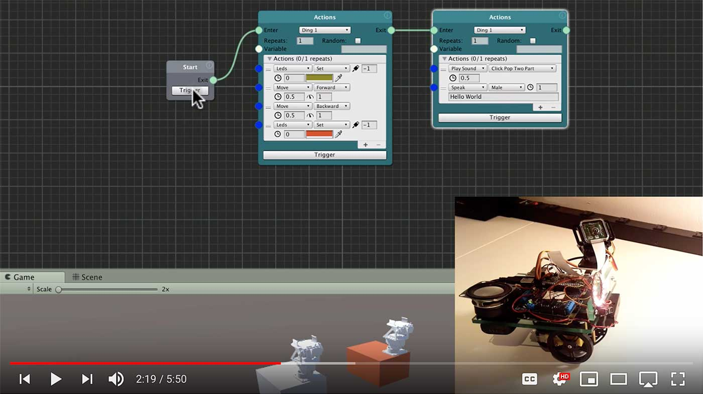
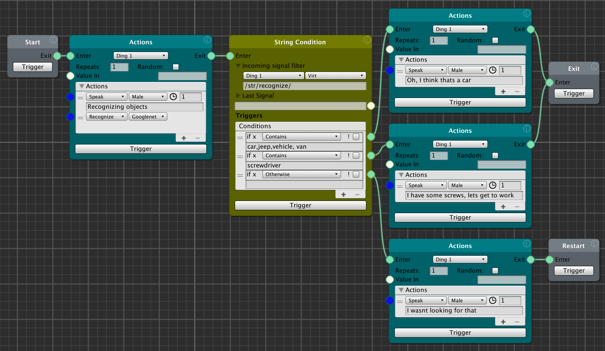
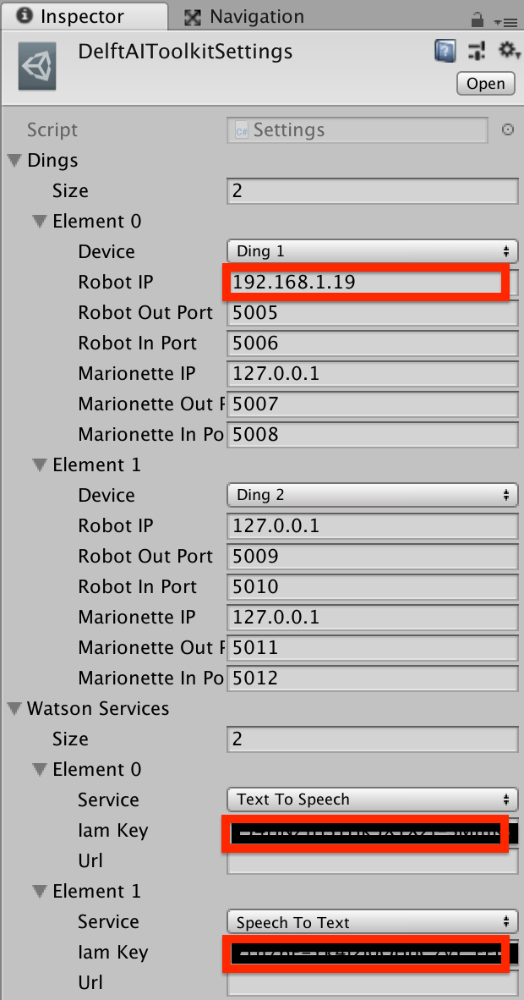
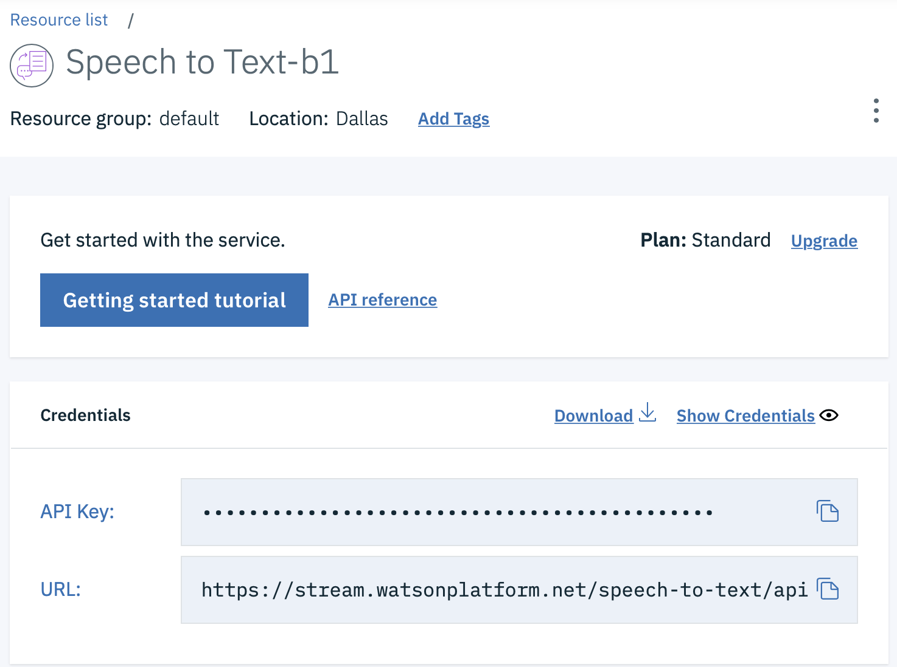

# Delft AI Toolkit
# Visual Authoring for AI Prototyping

The Delft AI Toolkit (DAI-TK) is a system for designing and researching smart things. It provides a visual authoring environment that simplifies the use of machine learning, cognitive APIs, and other AI approaches. The node-and-connection visual graphs combine the advantages of behavior trees and dataflow models to create smart behavior in autonomous devices.

DAI-TK enables quick prototyping, experimentation and iteration of AI interactions with powerful nodes that support behavioral sequences, sensing, decision making, state management, and the simple invocation of AI techniques such as speech to text, text to speech, and visual object recognition.  

In addition, it encourages design strategies that start with simulation and smoothly progress toward a working prototypes of machine learning and hardware.

* **Marionetting** - This approach allows the designer/researcher to control the smart thing in real time, responding to people and other contexts as if they were the AI being designed (e.g. reacting to user interactions by triggering voice responses or movements as it they were coming from an AI system). This remote control can happen wirelessly (e.g. using a tablet or phone), and provide a rapid feedback loop from testing to design.

* **3D/AR simulation** - Because hardware design and implementation can be time consuming, DAI-TK simulates the smart thing in 3D within Unity3D. This allows the designer/researcher to iteratively experiment with different approaches prior to committing to a particular hardware approach. In a future version of DAI-TK, designers will be able to place the smart thing 3D simulation in the real world through AR, as well as add AR augmentations of the smart thing.

<!-- TOC START min:2 max:3 link:true asterisk:false update:true -->
- [Video Introduction](#video-introduction)
- [Description](#description)
- [Documents](#documents)
- [System Components](#system-components)
  - [Visual Authoring & Control System running on a computer](#visual-authoring--control-system-running-on-a-computer)
  - [Robot/Device](#robotdevice)
- [Current Features](#current-features)
- [Roadmap as of](#roadmap-as-of)
- [System Architecture](#system-architecture)
  - [Hardware](#hardware)
  - [Raspberry Pi Disk Image](#raspberry-pi-disk-image)
- [Getting Started](#getting-started)
  - [Starting the System Up](#starting-the-system-up)
  - [Essential Robot Linux Commands](#essential-robot-linux-commands)
  - [Installing The Software](#installing-the-software)
<!-- TOC END -->
_________________________
## Video Introduction
[](http://www.youtube.com/watch?v=BjsFq0DOrgQ "Delft AI Toolkit Introduction")

## Description


The Delft AI Toolkit a system for designing smart things. It provides a visual authoring environment that incorporates machine learning, cognitive APIs, and other AI approaches, behavior trees, and data flow to create smart behavior in autonomous devices.

The goal of this project is to develop an approach to authoring AI that enables designers to easily and iteratively prototype smart things. This approach includes the ability to Wizard-of-Oz AI behaviors and simulate physical hardware in 3D, and then migrate these simulations to working prototypes that use machine learning and real hardware.

## Documents
* [Toolkit Documentation](docs/README.md)
* [ACM Interactions Article on Project](http://www.philvanallen.com/articles/PrototypingWaysOfPrototypingAI-ACM-Interactions.pdf)
* [Short Project description](http://www.philvanallen.com/portfolio/delft-ai-toolkit/)

## System Components
### Visual Authoring & Control System running on a computer
  * Visual Authoring with nodes in the Unity3D authoring environment
### Robot/Device
  * Raspberry Pi + Adafruit Crikit Hat
  * Motors, servos, sensors, LEDs, microphone, speaker, camera, etc.

Each of these has a codebase here, and include a range of open source libraries.

This system also uses [xNode](https://github.com/Siccity/xNode), which is being enhanced by Siccity as part of this project.

## Current Features
* **Action Types** - text2speech, speech2text, camera based object recognition, position servos, move wheels, leds
* **Action Options** - repeat, random
* **Machine Learning** - performs object recognition (machine vision) onboard the RPi, and allows model selection (Squeezenet, Alexnet, Googlenet, Inception, Rcnn). Recognition speeds range from 0.6secs to 2.0secs.
* **Cognitive Services** - Supports IBM Watson Text to Speech and Speech to Text in the Unity simulation, and on the robot. Other Watson services planned.
* **Inputs** - analog sensors, keyboard, OSC, capacitive touch
* **Conditions** - numeric: gt/lt/range, string: start/end/contains/multiple
* **Behavior Trees/Data Flow** - multiple node ins/outs, loops, restart, individual node trigger for testing, visual indication of active node and action within node



## Roadmap as of
* Add additional Watson services (e.g. Assistant, Emotion, Sentiment, etc.)
* More nodes for processing sensor data and logic
* More video and written documentation
* Better support for IoT (e.g. IFTTT, web-hooks)
* Integrate gesture recognition learning and classification
* Integrate Unity Reinforcement learning

## System Architecture


### Hardware
The physical robot is currently based on a simple robot platform from Adafruit, combined with a Raspberry Pi to perform the local edge AI, local text-to-speech, and make use of cloud APIs. The RPi talks over serial to an Arduino with a motor hat for the DC motors and Servos. The robot RPi communicates with Unity on the computer with the OSC network protocol.

Note: The next hardware version planned will eliminate the Arduino and replace it with the Adafruit [Crickit Hat](https://www.adafruit.com/product/3957) for the RPi. This will simplify hardware and software, and make a more compact robot.

[More details on the hardware](docs/hardware.md).

&nbsp;

### Raspberry Pi Disk Image
* [Raspberry Pi Disk Image & Installation Details](docs/hardware.md#installing-the-delft-ai-toolkit-disk-image)

## Getting Started

### Starting the System Up
1. **Power the Robot**: Power on the Raspberry Pi (RPi):
     * **RPi**: Connect a 5V 2A AC adapter, or the USB battery to the barrel jack on the CRICKIT -- this will power the RPi as well

1. **Get the WiFi IP address of the Robot**
     * **Your RPI must already connect by WiFi** - If you haven't already, [set up your RPI to connect to your local WiFi](https://www.raspberrypi.org/documentation/configuration/wireless/wireless-cli.md) using an ethernet cable.
     * **Connect by Ethernet if necessary** - Some networks don't allow connection by the .local (Bonjour) name. If so, hook up an ethernet cable between your computer and the Raspberry Pi (RPi) on the robot (you may need a [USB-C adapter](https://www.amazon.com/dp/B01M6WQ0T0/ref=twister_B06ZZLKBWJ)
     * **Login to the RPi** - Open a terminal window on your computer, and log into the RPi by typing in the below. Change the number at the end of delftbt0 to match the number of your robot if you changed the name.

     ```bash
     ssh pi@delftbt0.local
     ```
     * **Password** - The default password for the standard Delft AI Toolkit disk image is "**adventures**"
     * **Get the RPi WiFi IP Address** - Once logged in, copy and save the IP address of the RPi by typing the below. You'll see an entry for **"wlan0"** which is the WiFi connection - from there copy the IP address (e.g. 10.4.27.47)

     ```bash
    ifconfig
    ```
     * **Logout** - of the RPI by typing

     ```bash
     exit
     ```

     * **Disconnect** - Unplug the ethernet cable

1. **Start the Delft Toolkit software on the RPi**

     * **Login to RPi** - In the terminal app log in to the RPi over WiFi by typing:

     ```bash
     ssh pi@10.4.27.47 # replace this IP address with the one you got from ifconfig above
     ```

     * **Start the software** - After logging in, type the below command, putting the IP address of your Unity computer at the end (get the IP address of your computer by opening the Network Preferences panel)

     ```bash
     ./delft-ai-toolkit/start-delft-toolkit.sh 192.168.1.21
     ```
     * **Startup Sequence** - The software will take a little time to start up. When it finishes, the robot will say "Hello"

     * **IMPORTANT: Powering off the RPi Procedure**: Before you disconnect the power from the RPi, to prevent harm to the SD storage, **you must properly shut it down with the following command**. Wait for 10 seconds after the poweroff command, then it is safe to unplug the power from the RPi.

     ```bash
     sudo poweroff
     ```

1. **Start the software running in Unity**

      * **Open Project** - Open the "delft-toolkit" project in Unity3D (minimum version is 2019.3.x)
      * **Open Scene** - In the Project, open the the scene that matches the toolkit graph you are using (e.g. Assets>Scenes>MainExamples)
      * **Open Visual Graph** - In the Project Assets>DelftToolkitGraphs directory, double click on the toolkit visual graph you are currently using (e.g. Assets>DelftToolkitGraphs>MainExamples)
      * **Physical Robot** - If you are using the physical robot (the Unity toolkit will work fine without the robot):
        * From the Unity menubar, select Delft AI Toolkit>Show Settings. This will select the central settings document (Assets>Resources>DelftAIToolkitSettings) and you can make changes in the Inspector.<br>
        * In the inspector for "ding1", paste in the IP address of the robot where it says "Robot IP"
        * If you are not using the physical robot, leave the IP address set to 127.0.0.1
      * **IBM Watson** - If you are using any of the Watson services (e.g. TextToSpeech or SpeechToText), these run on both the computer and on the robot (selectable). To use these services, you'll need an IBM Cloud account (free for limited use).
        * Sign up for an account - http://cloud.ibm.com
        * Set up the service(s) you are using
        * Create credentials for using the service in the API Key format (also called IAM Key).<br>
        * Enter the API Key/IAM Key in the corresponding field in the settings document. Delft AI Toolkit>Show Settings
      * **Play** - Click on the Unity **Play** button
      * **Start Graph** - In the xNode Toolkit graph pane, click on the "Start" node Trigger button to run the whole graph, or use Trigger on any individual node
        * **For keyboard or OSC** - Click on the Game pane (this is to ensure Unity is receiving all commands -- if you find it is not responding to the keyboard or OSC, click this pane)


### Essential Robot Linux Commands

```bash
# login to the RPi via ethernet
ssh pi@delftbt0.local
# get the IP address of the RPi from the wlan0 section
ifconfig
# login to the RPi via WiFi, change the example IP to that RPi
ssh pi@10.4.27.47
# change to the toolkit software directory
cd delft-ai-toolkit
# start the RPi software, change the example IP to that of the computer running Unity
python3 delft_toolkit.py --server_ip 10.4.18.109
# shutdown before disconnecting the power, then wait for 10 seconds
sudo poweroff
```

### Installing The Software

See installation instructions on the [hardware documentation page](docs/hardware.md#installing-delft-ai-toolkit-software)
