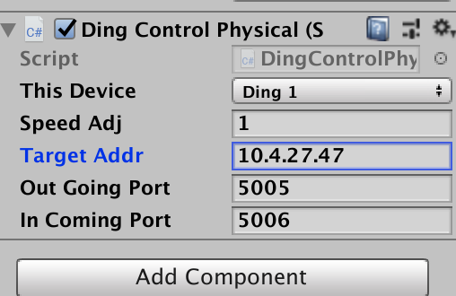

# Delft AI Toolkit - Version 2
## Visual Authoring Toolkit for Smart Things

**This is a new 2.0 version of this project with a significantly changed architecture ([original version](https://github.com/pvanallen/delft-toolkit)). The NodeCanvas node system has been replaced with [xNode](https://github.com/Siccity/xNode), which is being enhanced by Siccity as part of this project. In addition, the system now communicates directly with the Raspberry Pi (instead of using node.js and bluetooth).**

**As of February 2019, this version is nearing a usable release, which should be out by the end of February. At that time, we'll post a RasPi image that's ready to go to use with the toolkit.

### Description

The Delft Toolkit a system for designing smart things. It provides a visual authoring environment that incorporates machine learning, cognitive APIs, and other AI approaches, behavior trees, and data flow to create smart behavior in autonomous devices.


The goal of this project is to develop an authoring system approach that enables designers to easily and iteratively prototype smart things. This approach includes the ability to Wizard-of-Oz AI behaviors and simulate physical hardware in 3D, and then migrate these simulations to working prototypes that use machine learning and real hardware.

* [Overall Project description](http://www.philvanallen.com/portfolio/delft-ai-toolkit/)
* [Process Blog](http://ai-toolkit.tumblr.com)

The system has two parts:
* Authoring & Control System running on a computer
  * Visual Authoring with nodes in the Unity3D authoring environment
* Robot/Device
  * Raspberry Pi
  * Arduino (we may transition to the Adafruit Crikit for RPi once we have a chance to evaluate it)
  * Motors, servos, sensors, LEDs, microphone, speaker, camera, etc.

Each of these has a codebase, and includes a range of libraries. **We are using and helping create an improved version of the open source [xNode Unity asset](https://github.com/Siccity/xNode)**

### System Architecture


### Hardware
The physical robot is currently based on a simple robot platform from Adafruit with a Raspberry Pi to perform the local edge AI, local text-to-speech, and make use of cloud APIs. The RPi talks over serial to an Arduino with a motor hat for the DC motors and Servos. The robot communicates with Unity on the computer with the OSC network protocol.

### Hardware Parts list
* [Robot Platform Kit](https://www.adafruit.com/product/3244)
* [Raspberry Pi](https://www.adafruit.com/product/3775)
* [Pi Camera](https://www.adafruit.com/product/3099) & [8" camera cable](https://www.adafruit.com/product/1647)
* [Seeed Microphone Hat](https://us.seeedstudio.com/ReSpeaker-2-Mics-Pi-HAT-p-2874.html)
* [Arduino or Equivalent](https://www.sparkfun.com/products/11021)
* [Motor Shield for Arduino](https://www.adafruit.com/product/1438)
* [Speaker](https://www.adafruit.com/product/3351)
* [NeoPixel 12 Light Ring](https://www.adafruit.com/product/1643)
* [IR Sensor](https://www.adafruit.com/product/164)
* [Pan/Tilt Servo Kit](https://www.adafruit.com/product/1967)
* [USB 5V 2A Rechargeable Battery](https://www.amazon.com/Anker-PowerCore-Ultra-Compact-High-Speed-Technology/dp/B01CU1EC6Y/)
* [short USB A to Micro Cable - Battery to RPi](https://www.amazon.com/Micro-USB-Cable-Select-Models/dp/B01FSYBQ9Q/)
* [USB A to USB B - RPi to Arduino](https://www.amazon.com/Inovat-Printer-Cable-USB-Scanner/dp/B01HB91CRM/)


## Starting the system
1. **Power robot**: Power on the Arduino and Raspberry Pi (RPi) in the following order:
     * **Motors**: Turn on the 6V AA battery pack (you can leave this off to disable the servos and wheel motors, or to save the batteries. The robot will work fine other than the motors)
     * **Arduino** Powered by the USB cable from the RPi
     * **RPi**: Connect a 5V 2A AC adapter, or the USB battery to the micro USB connector

1. **Get the IP address of the robot**
     * Hook up an ethernet cable between your computer and the Raspberry Pi (RPi) on the robot (you'll need an adapter: USB-C (Links to an external site.)Links to an external site., Thunderbolt (Links to an external site.)Links to an external site.)
     * Open a terminal window on your computer, and log into the RPi by typing in the below. Change the number at the end of delftbt0 to match the number of your robot if you changed it to something other than delfbt0.

     ```bash
     ssh pi@delftbt0.local
     ```
     * The password for the standard toolkit disk image is "adventures"
     * Once logged in, copy and save the IP address of the RPi by typing:

     ```bash
    ifconfig
    ```

     * You'll see an entry for "wlan0" - from there copy the IP address (e.g. 10.4.27.47)
     * Logout of the RPI by typing

     ```bash
     exit
     ```

     * Disconnect the ethernet cable

1. **Start the Delft Toolkit software on the RPi**

     * If you are using the motors, turn on the 6V battery pack (or save the batteries for now, and turn the battery pack on when you are ready)
     * In the terminal app log in to the RPi over WiFi by typing:

     ```bash
ssh pi@10.4.27.47 (replace this IP address with the one you got from ifconfig above)
```

     * Once logged in, change directory to the delft-ai-toolkit directory:

     ```bash
cd delft-ai-toolkit
```
     * Get the IP address of your computer by opening Network Preferences
     Start the software, putting the IP address of your computer at the end for --server_ip:

     ```bash
     python3 delft_toolkit.py --server_ip 10.4.18.109
     ```
     * The software will take a little time to start up. When it finishes, the robot will say "Hello."
       * NOTE: Before you disconnect the battery from the RPi, you must properly shut it down with the following:

     ```bash
     sudo poweroff
     ```
       * Wait for 10 seconds, after the power off, then it's safe to unplug the power from the RPi

1. **Start the software running in Unity**

      * Open the "delft-toolkit" project in Unity3D (we've tested in version 2018.2.x)
      * In the Project, open the the scene that matches the toolkit graph you are using (e.g. Assets>Scenes>MainExamples)
      * In the Project Assets>DelftToolkitGraphs directory, double click on the toolkit visual graph you are currently using (e.g. Assets>DelftToolkitGraphs>MainExamples)
      * If you are using the physical robot (the toolkit will work fine without the robot)
        * Click on the simulated robot in the Hierarchy (e.g. ding1), and in the inspector, enable the "Ding Control Physical" script. If you are not using the physical robot, keep this script unchecked and inactive.
        * Still in the inspector at "Ding Control Physical," paste in the IP address of the robot where it says "Target Addr"
        * 
      * Click on the Unity **Play** button
      * In the xNode Toolkit graph pane, click on the "Start" node Trigger button to run the whole graph, or use Trigger on any individual node
      * Click on the Game pane (this is to ensure Unity is receiving all commands -- if you find it is not responding to the keyboard or OSC, click this pane)


## Robot Command Line Essentials ##

```bash
# login to the RPi via ethernet
ssh pi@delftbt0.local
# get the IP address of the RPi from the wlan0 section
ifconfig
# login to the RPi via WiFi, change the example IP to that RPi
ssh pi@10.4.27.47
# change to the toolkit software directory
cd delft-ai-toolkit
# start the RPi software, change the example IP to that of the computer running Unity
python3 delft_toolkit.py --server_ip 10.4.18.109
# shutdown before disconnecting the power, then wait for 10 seconds
sudo poweroff
```

## Installing The software

1. **Install [Unity3D](https://store.unity.com)**
1. **Download the toolkit software** and place on your computer
   * Unity project and Arduino code from github [DelftToolkit](https://github.com/pvanallen/delft-toolkit-v2)
   * Disk image for [RPi]() - NEW VERSION NOT YET AVAILABLE
1. **Arduino**:
   * Install delftToolkit.ino on your Arduino with the Arduino IDE
1. **RPi**: Burn the RPi image to your SD card
   * [Set up your WiFi](https://www.raspberrypi.org/documentation/configuration/wireless/wireless-cli.md) with `sudo nano /etc/wpa_supplicant/wpa_supplicant.conf`
   * Change the hostname from the default of delftbt0 (e.g. delftbt1, delftbt2, etc.) if you are using more than one robot on your network
