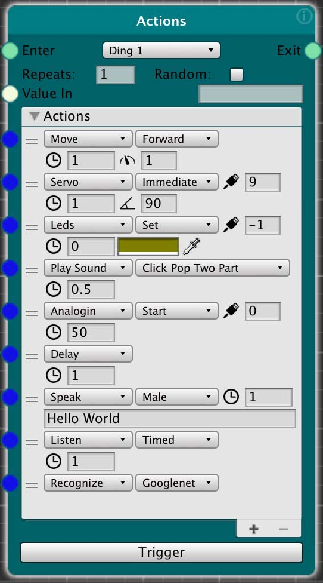

# Action Node

The action node performs a sequence of actions from top to bottom, where each action completes before the next one down runs. Control will pass on to the next node(s) when the last action completes.

The actions are communicated to all virtual or physical device with the specified name (e.g. Ding 1). In a typical situation, this means that the virtual representation of the AI system inside of Unity, and the physical device driven by the Raspberry Pi will respond simultaneously.

Currently, only the physical device will respond to the "Speak" and "Listen" actions, but a future release will enable the virtual system to do this as well.
_________________
<!-- TOC START min:2 max:3 link:true asterisk:false update:true -->
- [Creating Actions](#creating-actions)
- [Repeats](#repeats)
- [Random](#random)
- [Actions](#actions)
  - [Move - Causes the device to move](#move---causes-the-device-to-move)
  - [Servo - Moves a servo to an angle](#servo---moves-a-servo-to-an-angle)
  - [Leds - Sets the color of device LEDs](#leds---sets-the-color-of-device-leds)
  - [Play Sound - Plays a sound effect](#play-sound---plays-a-sound-effect)
  - [Analogin - Starts or stops values from a sensor](#analogin---starts-or-stops-values-from-a-sensor)
  - [Delay - Pauses the sequence of actions](#delay---pauses-the-sequence-of-actions)
  - [Text To Speech - Convert text to spoken word](#text-to-speech---convert-text-to-spoken-word)
  - [Speech To Text - Transcribe spoken words to text](#speech-to-text---transcribe-spoken-words-to-text)
  - [Recognize - Perform object recognition from the camera](#recognize---perform-object-recognition-from-the-camera)
<!-- TOC END -->
_________________

## Creating Actions
Each action added to the node will perform in sequence.

* **Add** - To add an action, click on the "+" button, which add a duplicate of the last action as a starting point
* **Reorder** - Drag the "=" symbol to reorder them
* **Delete** - To delete a condition, select the condition row and click the "-" button

## Repeats

The repeats field sets the number of times the entire node sequence will run, top to bottom. If Random is enabled, the Repeat number determines the total number of random actions run, one per repeat.

## Random

The Random checkbox changes the behavior of the node to run one random action in the sequence each repeat. So if Repeats is set to 1, a single random action will run, and then control will pass to the next node. If Repeats is set to 5, a new random action in the sequence will run each repeat, for a total of 5 actions run.

Note that this is a standard random function currently, so it is possible for the same action to run twice in a row during random set of repeats.

## Actions
### Move - Causes the device to move
* *Direction* - Forward or Backward, or turn Left or Right in place (i.e. the two wheels turn in opposite directions)
* *Time* - Number of seconds the movement will run. Zero sets the movement to run until changed, and control passes immediately on the to the next action.
* *Speed* - Speed of the movement

### Servo - Moves a servo to an angle
* *Movement* Type - Not yet implemented. In the future will enable control of the speed of the servo motion. Currently moves at maximum speed.
* *Port* - The port the servo is attached to
* *Time* - Number of seconds the action waits before passing control to the next action
* *Angle* - The target angle to move the servo to

### Leds - Sets the color of device LEDs
* *Type* - Determines how the LEDs will behave
  * Set - Sets the color of the LEDs
  * Blink - Blinks the LEDs, using the "port" setting for the number of blinks, and the "time" for the amount of time for each "on" period in seconds
  * All Off - Turns all the LEDs off regardless of port/color settings
* *Port* - Sets the LED to be set (0-12). If -1, all LEDs will be set
* *Time* - Number of seconds the action waits before passing control to the next action
* *Color* - Opens a color picker to set the color the LEDs will be set to

### Play Sound - Plays a sound effect
* *Sound* - Sets the sound to be played
* *Time* - Number of seconds the action waits before passing control to the next action
* *User Sounds* - Note that there are five placeholder sound files (UserSound1.wav - UserSound5.wav) built into the system which can be replaced by the user with their own sound files - 16bit/stereo/44.1K/.wav format.
  * Unity - To change the sounds in Unity, go to the folder *Assets>Resources>ui_sounds* and replace any of the UserSound#.wav files with your own.
  * Robot - To change the sounds on the robot, Use FTP or mount the RPi as a server, and replace any of the UserSound#.wav files with your own.
    * FTP
      * In your FTP program (e.g. CyberDuck) connect to the RPi
      * Type in the the IP address
      * Put in the RPi login: pi, adventures
      * Navigate to *delft-ai-toolkit>audio>ui_sounds* and replace the files
    * Mount the RPi as a server (Mac)
      * In the Finder, select Go>Connect to server…
      * Type in the IP address of your RPi in the following way: smb://10.4.17.93
      * Press Connect, and put in the RPi login: pi, adventures
      * You will then see the RPi appear in your servers in the left side of the Finder
      * Navigate to *delft-ai-toolkit>audio>ui_sounds* and replace the files

### Analogin - Starts or stops values from a sensor
* *Action* - Start tells the virtual or physical device to start sending values. Stop ends the sending of values
* *Port* - Specifies the port the sensor is connected to.
  * It is possible to have the robot send more than one sensor at a time. Plug your sensors into one of the six analog inputs on the Arduino (the IR distance sensor is normally plugged into input 0)
* *Interval* - Milliseconds of delay between each sensor value sent. E.g. 50ms means that values will be sent 20 times per second

### Delay - Pauses the sequence of actions
* *Time* - Seconds of delay before the next action

### Text To Speech - Convert text to spoken word
* *Model* - Select the model to perform the TTS, Watson (cloud), Pico (edge, robot only)
* *Virtual or Physical Robot* - Whether the speech is generated on the Physical robot (**Phys**), the Unity Virtual robot (**Virt**), or both (**Both**)
* *Time* - Number of seconds the action waits before passing control to the next action
* *Voice* - Select a language, country, voice combination. Not all voices are available in all models. (Note: we are looking into make a gender neutral voice available)
* *Utterance* - The text to be spoken
* **Note**: - To use the Watson model, you must enter the API Key/IAM key obtained from your Watson account in the Unity menu Delft AI Toolkit>Show Settings

### Speech To Text - Transcribe spoken words to text
* *Model* - Only Watson currently, and this option is not shown. In the future, we hope to also implement Snips.ai, which is an edge based system (i.e. no internet connection required).
* *Virtual or Physical Robot* - Whether the speech is transcribed on the Physical robot (**Phys**), the Unity Virtual robot (**Virt**), or both (**Both**)
* *Length* - Seconds the device listens before turning off microphone and transcribing. Control passes immediately on to the next action regardless of setting
* *Language* - Select a language, country combination. Not all languages are available in all models.
* **Note**: - To use the Watson model, you must enter the iamkey obtained from your Watson account in the Unity menu: Delft AI Toolkit>Show Settings

### Recognize - Perform object recognition from the camera
* *Recognition Model* - Select the machine learning model to be used. The models are well known models, where they are simple and fast at the top of the list, and more accurate and slower at the bottom of the list. **Note**: Actual object recognition happens on the robot, but in the virtual environment "recognition" occurs by putting a Unity tag on the gameobject in the scene. In the Unity virtual environment, the Recognition Model setting has no effect.
