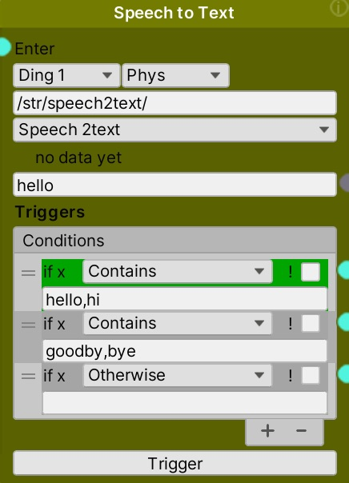
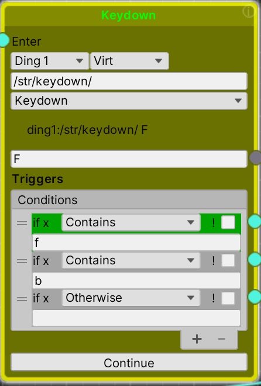
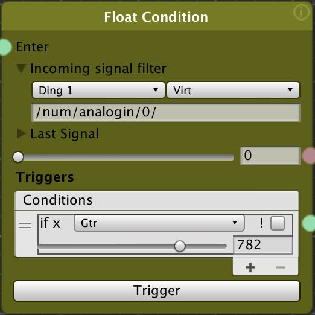

# Condition Nodes

The condition nodes (String/Text and Float/Numbers) wait for conditions to be met, and then pass control to the next node associated with the met conditions. They only act on new data received from it's input.

For example, if a sensor on the robot is reading distance, a condition can be set up to pass control to an action node that turns the robot when the distance indicates the robot is close to an object in front of it. If the robot is far enough away, another condition trigger can connect to a node the moves the robot straight forward.

Note that the interface for these nodes is still rough, and we hope to make them easier to use in the near future.
_______________
<!-- TOC START min:2 max:3 link:true asterisk:false update:true -->
- [Using the String and Float Condition Nodes](#using-the-string-and-float-condition-nodes)
- [String Condition Node](#string-condition-node)
  - [Setting the input data source](#setting-the-input-data-source)
  - [Creating Trigger Conditions](#creating-trigger-conditions)
  - [Condition Types](#condition-types)
  - [The ! Not Checkbox](#the--not-checkbox)
- [Float Condition Node](#float-condition-node)
  - [Setting the input data source](#setting-the-input-data-source-1)
  - [Creating Trigger Conditions](#creating-trigger-conditions-1)
  - [Three kinds of conditions](#three-kinds-of-conditions)
  - [The ! Not Checkbox](#the--not-checkbox-1)
<!-- TOC END -->
________________
## Using the String and Float Condition Nodes
The condition nodes listen to incoming values and make decisions based on user defined trigger conditions. If the node is active, and any of the triggers match, control will be passed on to the node attached to that trigger. Multiple triggers are possible, and can be simultaneously matched.

Even if the node is not active, it will still indicate if any matches are occurring by highlighting the matching trigger in green.

You can manually test the condition by changing the incoming value. To do this, enter a value in the area just above the "Triggers." In the Float Condition, you can also move the slider back and forth to simulate values.

## String Condition Node

### Setting the input data source
There are several things you need to set for the node receive the data it will evaluate
* **Robot ID** - The robot you are listening to (e.g. Ding 1)
* **Virtual or Physical Robot** - Whether the incoming data is from the Physical robot (**Phys**) or the Unity Virtual robot (**Virt**)
* **Data Source** - The "Incoming Signal Filter" to specify the specific incoming data that the condition will evaluate. Set the URL to match the type of input source you want. Use the following:


``` bash
/str/speech2text/ - from "Phys" robot, converting speech to text
/str/recognize/ - from "Phys" or "Virt" robot object classification
/str/keydown/ - from "Virt" keyboard key pressed
```
&nbsp;

 

### Creating Trigger Conditions
The trigger conditions determine which node(s) will run next. If the trigger condition is met, the node connected (from the green dot) to that condition will run next. Multiple conditions are possible, and more than one can trigger at the same time.

* **Add** - To add a condition, click on the "+" button
* **Reorder** - Drag the "=" symbol to reorder them
* **Delete** - To delete a condition, select the condition and click the "-" button

### Condition Types
* **Starts With** - If the incoming text starts with the text in the condition field, the attached node will run
* **Ends With** - If the incoming text ends with the text in the condition field, the attached node will run
* **Contains** - If the incoming text contains the text in the condition field, the attached node will run. For this type, you can have multiple options separated by commas. If any of the comma delimited entries is matched, the condition will be true and the attached node will run. For example, in the above object recognition node, one condition is set to any of "car,van,vehicle,jeep" to handle different kinds of vehicles identified in the same way.
* **Otherwise** - If no conditions above the Otherwise condition have matched, the node connected to this condition will run
* **AllTrue** - If all of the conditions above have matched, the node connected to this condition will run

### The ! Not Checkbox
The ! checkbox will invert the condition you set up. So for example, if the condition is `Starts With` and text of `car` with the `! checkbox` checked then any incoming text that does NOT start with "car" will trigger that condition and corresponding connected node.

## Float Condition Node


### Setting the input data source
To select what data the condition node listens to, set the Incoming signal filter.

* **Robot ID** - The robot you are listening to (e.g. Ding 1)
* **Virtual or Physical Robot** - Whether the incoming data is from the Physical robot (**Phys**) or the Unity Virtual robot (**Virt**)
* **Data Source** - The "Incoming Signal Filter" to specify the specific incoming data that the condition will evaluate. Set the URL to match the type of input source you want. Use the following:


``` bash
# values from a sensor, set the last digit to select the port used
/num/analogin/0/ # from "Phys" or "Virt"
# receives data from an OSC marionette device
# OSC from the TouchOSC app
# change last number for a different button
/num/1/push1/ # from "Virt"
# OSC from the Clean OSC app
/num/clean_button_2/ # from "Virt"
```

Note that for OSC to be received, the sending device (e.g. a phone) must send to the IP of the computer running Unity (by default, port 5008). In addition the IP address of the device should be set in the DingControlVirtual IP setting in the Unity inspector for the robot game object.

### Creating Trigger Conditions
The trigger conditions determine which node(s) will run next. If the trigger condition is met, the node connected (from the green dot) to that condition will run next. Multiple conditions are possible, and more than one can trigger at the same time.

* **Add** - To add a condition, click on the "+" button
* **Reorder** - Drag the "=" symbol to reorder them
* **Delete** - To delete a condition, select the condition and click the "-" button

### Three kinds of conditions
* **Gtr** - If the incoming value is **greater** than the setting value, the attached node will run
* **Lss** - If the incoming value is **less** than the setting value, the attached node will run
* **Range** - If the incoming value within the range set by the two setting values (low and high), the attached node will run. For example, if the range is set to 100-200, any value equal to 100 and greater, up to and including 200, will trigger the next node.

### The ! Not Checkbox
The ! checkbox will invert the condition you set up. So for example, if the condition is `Range` with a setting of `100` and `200` and with the `! checkbox` checked, then any value less than 100 OR greater than 200 will trigger the next node.
