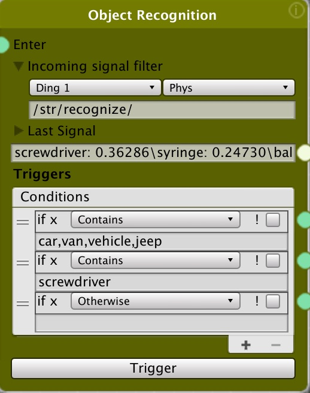
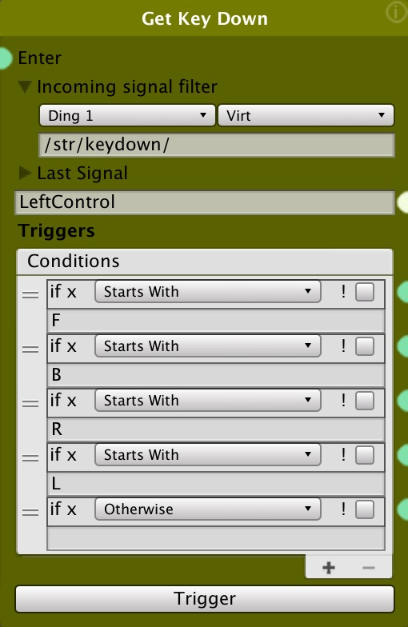

## String Condition Node##

### Setting the input data source###
There are several things you need to set for the node receive the data it will evaluate
* The robot you are listening to (e.g. ding1)
* Whether the data is coming form the Physical robot (**Phys**) or the Unity Virtual robot (**Virt**)
* The "Incoming Signal Filter" to specify the specific incoming data that the condition will evaluate. Set the URL to match the type of source you want.


``` bash
/str/speech2text/ - from "Phys" robot, converting speech to text
/str/recognize/ - from "Phys" or "Virt" robot object classification
/str/keydown/ - from "Virt" keyboard key pressed
```
&nbsp;

 

### Creating Trigger Conditions
The trigger conditions determine which node will run next. If the condition is met, the node connected (from the green dot) to that condition will run. Multiple conditions are possible, and more than one can trigger at the same time.

* **Add** - To add a condition, click on the "+" button
* **Reorder** - Drag the "=" symbol to reorder them
* **Delete** - To delete a condition, click on the "-" button

### Four kinds of conditions ###
* **Starts With** - If the incoming text starts with the text in the condition field, the attached node will run
* **Ends With** - If the incoming text ends with the text in the condition field, the attached node will run
* **Contains** - If the incoming text contains the text in the condition field, the attached node will run. For this type, you can have multiple options separated by commas. If any of the comma delimited entries is matched, the condition will be true and the attached node will run. For example, in the above object recognition condition, one condition is set to may any of "car,van,vehicle,jeep"
* **Otherwise** - If no conditions above the Otherwise condition have matched, the node connected to this condition will run

### The ! Not Checkbox ###
The ! checkbox will invert the condition you set up. So for example, if the condition is `Starts With` and text of `car` with the `! checkbox` checked then any incoming text that does NOT start with "car" will trigger that condition and corresponding connected node.
