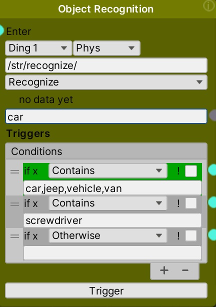
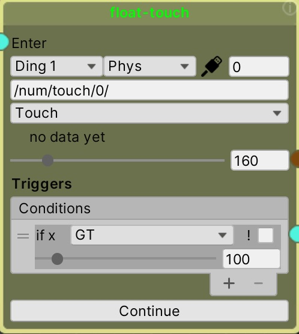
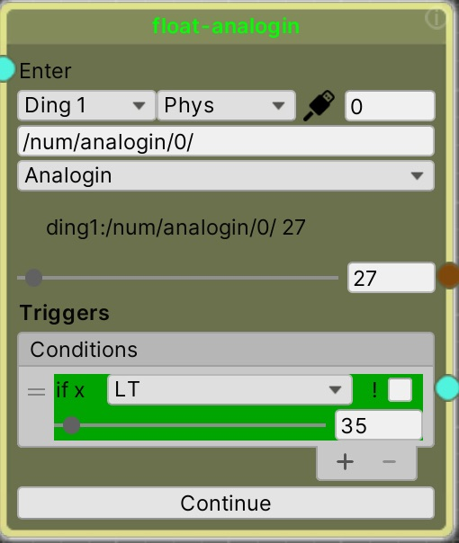

# Condition Nodes

The condition nodes (String/Text and Float/Numbers) wait for incoming data to trigger conditions, and then pass control to the next nodes connected to the met conditions. They only act when new data is received from their input.

For example, if a proximity sensor on the robot is reading distance, a condition can be set up to pass control to an action node that turns the robot when the distance indicates the robot is close to an object in front of it.
_______________
<!-- TOC START min:2 max:3 link:true asterisk:false update:true -->
- [Using the String and Float Condition Nodes](#using-the-string-and-float-condition-nodes)
- [String Condition Node](#string-condition-node)
  - [Setting the input data source](#setting-the-input-data-source)
  - [Creating Trigger Conditions](#creating-trigger-conditions)
  - [Condition Types](#condition-types)
  - [The ! Not Checkbox](#the--not-checkbox)
- [Float Condition Node](#float-condition-node)
  - [Setting the input data source](#setting-the-input-data-source-1)
  - [Creating Trigger Conditions](#creating-trigger-conditions-1)
  - [Condition Types](#condition-types-1)
  - [The ! Not Checkbox](#the--not-checkbox-1)
<!-- TOC END -->
________________
## Using the String and Float Condition Nodes
The condition nodes listen to incoming values and make decisions based on user defined trigger conditions. If the node is active, and any of the trigger conditions match, control will be passed on to the node attached to that trigger. Multiple triggers are possible, and can be simultaneously matched.

Even if the node is not active, it will still indicate if any matches are occurring by highlighting the matching trigger in green.

You can manually test the condition by changing the incoming value. To do this, enter a value in the area just above the "Triggers." In the Float Condition, you can also move the slider back and forth to simulate values.

## String Condition Node


### Setting the input data source
There are several things you need to set for the node receive the data it will evaluate
* **Robot ID** - The robot you are listening to (e.g. Ding 1)
* **Virtual or Physical Robot** - Whether the incoming data is from the Physical robot (**Phys**) or the Unity Virtual robot (**Virt**)
* **Data Source** - The "Incoming Signal Filter" dropdown is used to specify the specific incoming data that the condition will evaluate. The dropdown sets the URL to match the OSC input source you want. The following are supported:

``` bash
Speech2Text - from "Phys" (robot) or "Virt" (inside Unity), converting speech to text
Recognize - from "Phys" (robot) or "Virt" (inside Unity), visual object classification
Keydown - from "Virt" any keyboard key pressed
```
&nbsp;
KEYDOWN NOTE: when listening for a keydown press from the keyboard, you must have Unity in Play Mode and have clicked on the Game pane so that Unity will receive the keyboard clicks. Keydown will not work otherwise.

 &nbsp;&nbsp;&nbsp;&nbsp;

### Creating Trigger Conditions
The trigger conditions determine which node(s) will run next. If the trigger condition is met, the node connected (from the green dot) to that condition will run next. Multiple conditions are possible, and more than one can trigger at the same time.

* **Add** - To add a condition, click on the "+" button
* **Reorder** - Drag the "=" symbol to reorder them
* **Delete** - To delete a condition, select the condition and click the "-" button

### Condition Types
* **Starts With** - If the incoming text starts with the text in the condition field, the attached node will run
* **Ends With** - If the incoming text ends with the text in the condition field, the attached node will run
* **Contains** - If the incoming text contains the text in the condition field, the attached node will run. For this type, you can have multiple options separated by commas. If any of the comma delimited entries is matched, the condition will be true and the attached node will run. For example, in the above object recognition node, one condition is set to any of "car,van,vehicle,jeep" to handle different kinds of vehicles identified in the same way.
* **Otherwise** - If no conditions above the Otherwise condition have matched, the node connected to this condition will run
* **AllTrue** - If all of the conditions above have matched, the node connected to this condition will run

### The ! Not Checkbox
The ! checkbox will invert the condition you set up. So for example, if the condition is `Starts With` and text of `car` with the `! checkbox` checked then any incoming text that does NOT start with "car" will trigger that condition and corresponding connected outlet node.

## Float Condition Node
&nbsp;&nbsp;

### Setting the input data source
To select what data the condition node listens to, set the Incoming signal filter.

* **Robot ID** - The physical or virtual robot you are listening to (Ding1-Ding4)
* **Virtual or Physical Robot** - Whether the incoming data is from the Physical robot (**Phys**) or the Unity Virtual robot (**Virt**)
* **Port #** - The port the data is coming from - in the case of analogin or touch, this is the physical port on the robot. In the case of an OSC message (e.g. from TouchOSC or CleanOSC), this specifies the button or other control to listen for
* **Data Source** - The "Incoming Signal Filter" dropdown is used to specify the incoming data that the condition will evaluate, by setting the OSC message "URL" to listen to. The following are supported:

``` bash
# values from a sensor, set the port used
Analogin -- /num/analogin/1/ #get the value from an analog sensor, "Phys" (ports 1-8) or "Virt"
Touch -- /num/touch/1/ #get the value from a touch sensor, "Phys" (ports 1-4) only
# receive data from an OSC marionette device
# OSC from the TouchOSC app -- node must be set to "Virt"
TouchOSC  -- /num/1/push1/ # change port number for a different button
# OSC from the CleanOSC app -- node must be set to "Virt"
CleanOsc -- /num/clean_button_2/ # change port number for a different button   
# any other OSC message - the node only pays attention to a match with the beginning of the message
Any # type in any OSC url message to match, prefixed with /num/
```
* [TouchOSC](https://hexler.net/products/touchosc) $5
* [CleanOSC](https://cleanosc.app) Free

**Note:** For OSC to be received, the sending device (e.g. a phone/tablet) must send to the IP of the computer running Unity (by default, on port 5008). In addition, the IP address of the sending device should be set in the Marionette IP setting in the Unity inspector for the Toolkit settings.

### Creating Trigger Conditions
The trigger conditions determine which node(s) will run next. If a trigger condition is met, the node connected (from the green dot) to that condition will run next. Multiple conditions are possible, and more than one condition can trigger at the same time.

* **Add** - To add a condition, click on the "+" button
* **Reorder** - Drag the "=" symbol to reorder them
* **Delete** - To delete a condition, select the condition so it is highlighted and click the "-" button

### Condition Types
* **GT** - If the incoming value is **Greater Than** the setting value, the attached node will be triggered
* **LT** - If the incoming value is **Less Than** the setting value, the attached node will be triggered
* **Range** - If the incoming value within the range set by the two setting values (low and high), the attached node will be triggered. For example, if the range is set to 100-200, any value equal to 100 and greater, up to and including 200, will trigger the next node.
* **Otherwise** - If the incoming value does not match any of the above conditions, the attached node will be triggered

### The ! Not Checkbox
The ! checkbox will invert the condition you set up. So for example, if the condition is `Range` with a setting of `100` and `200` and with the `! checkbox` checked, then any value less than 100 **OR** greater than 200 will trigger the node attached to this condition.
