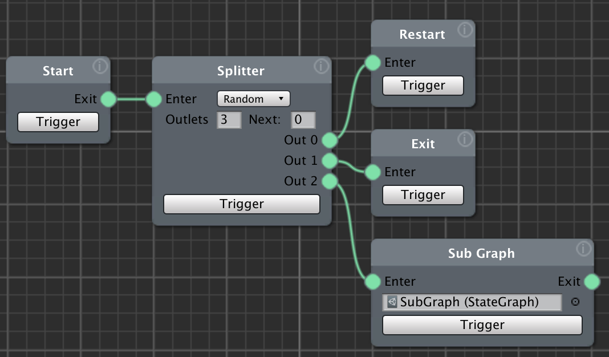

# Graph Control Nodes

The graph control nodes affect the flow of activation through the graph.
_________________
<!-- TOC START min:2 max:3 link:true asterisk:false update:true -->
- [Start - Start the graph](#start---start-the-graph)
- [Splitter - Route control to different options](#splitter---route-control-to-different-options)
- [SubGraph - Collapse a project module into a single node](#subgraph---collapse-a-project-module-into-a-single-node)
- [Restart - Routes control back the beginning of the graph](#restart---routes-control-back-the-beginning-of-the-graph)
- [Exit - Ends execution of the graph branch](#exit---ends-execution-of-the-graph-branch)
<!-- TOC END -->
_________________

## Start - Start the graph
The Start node goes at the beginning of a graph and initiates it. It will be triggered when you right-click on the graph and select "run".

When using a Restart node at the end of a graph, control passes from the Restart node to the Start node.

## Splitter - Route control to different options
The Splitter node has one input and a configurable number outputs. When activated, it passes control to one of its outputs, either randomly or sequentially.

This node can be used to create variation in the performance of the system. For example, with the node set to 2 outputs and sequential, it will toggle between the two different outputs each time that section of the graph runs.

In another example, if the node is set with 4 outputs and random, each time the node is activated, a random one of four connected sets of actions could be triggered.

## SubGraph - Collapse a project module into a single node

The SubGraph node allows the user to collapse a multi-node module of a project into a single node. The module's nodes are contained in a separate graph that's associated with the SubGraph node

To associate the module graph, click the little circle next to the sub graph field, and select the graph to be represented. Or drag the graph from the project window into the field.

The graph used with the SubGraph node MUST have a Start and Exit node that begin and end the graph respectively.

## Restart - Routes control back the beginning of the graph

The Restart node sends control back to Start node at the beginning of the graph.

## Exit - Ends execution of the graph branch

The Exit node stops activation from passing beyond the Exit node. Other branches may continue.
