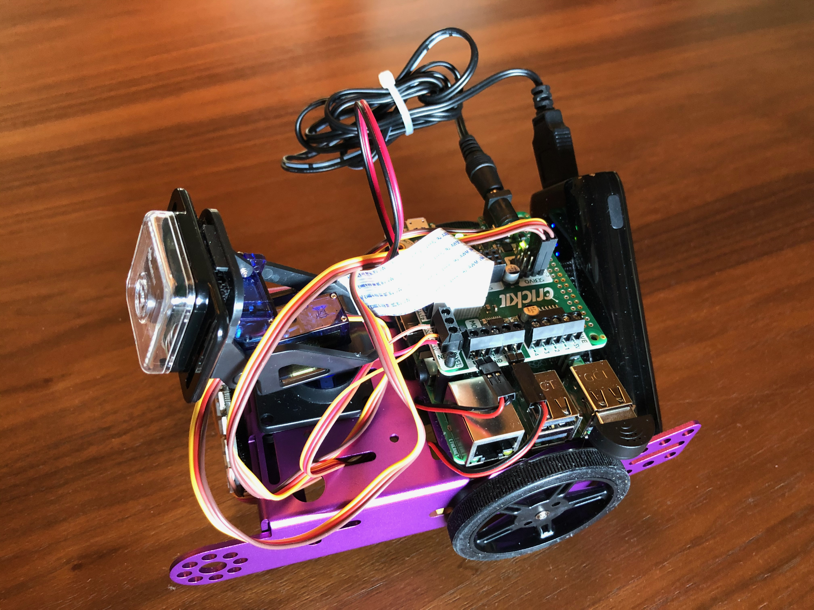
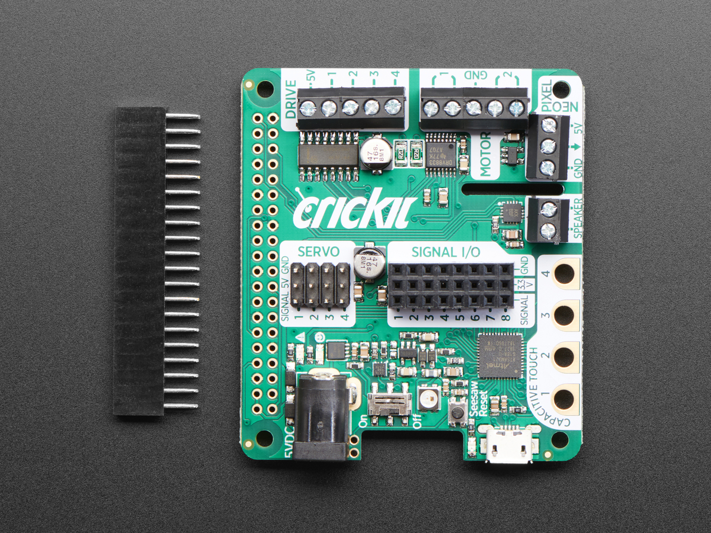
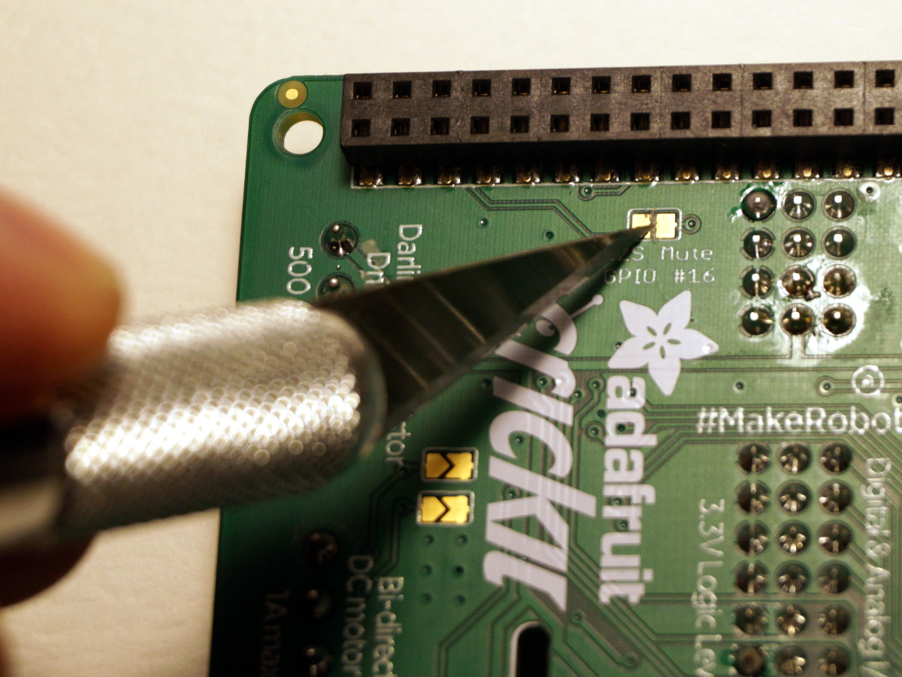
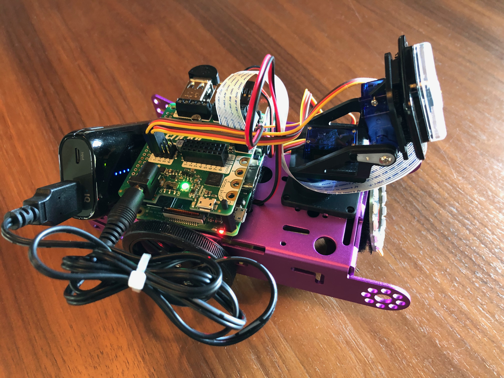
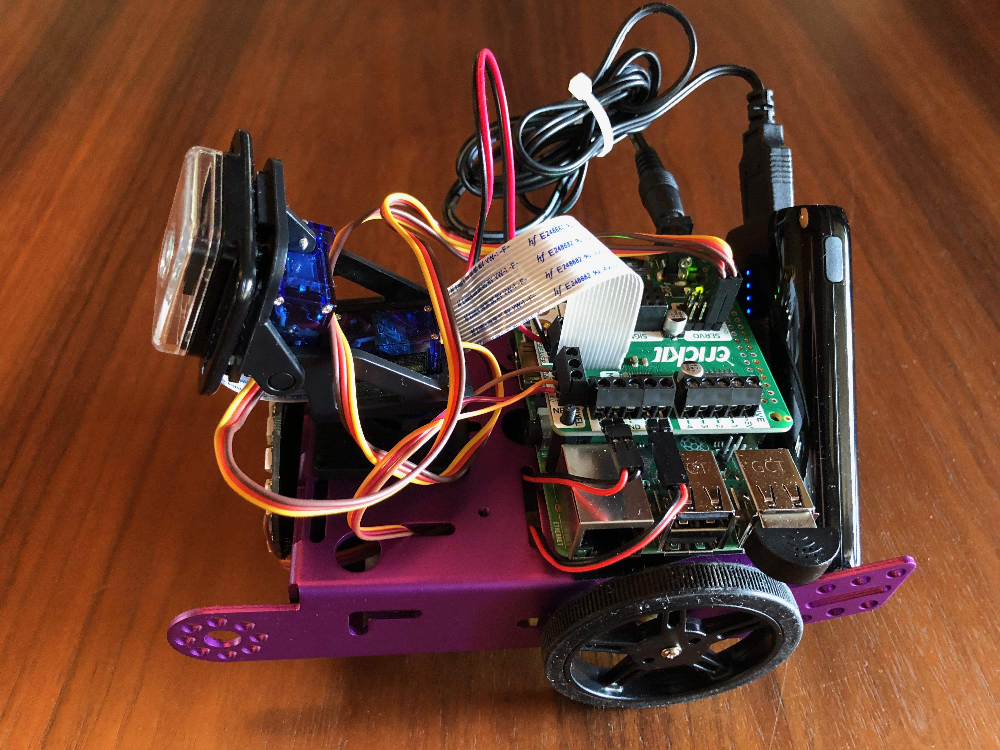
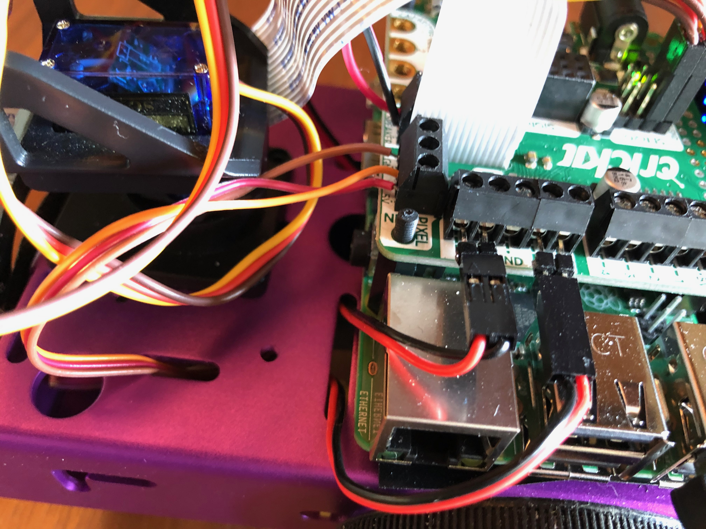
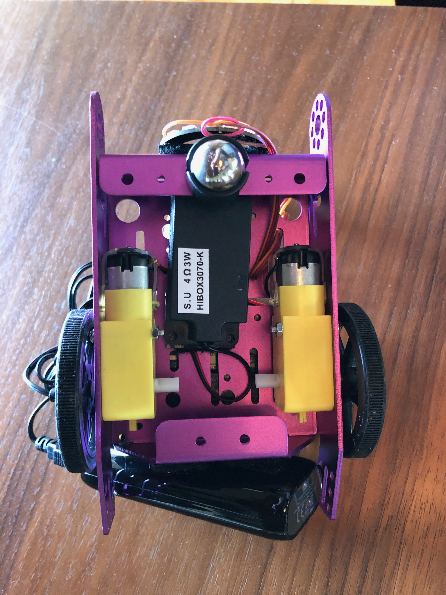
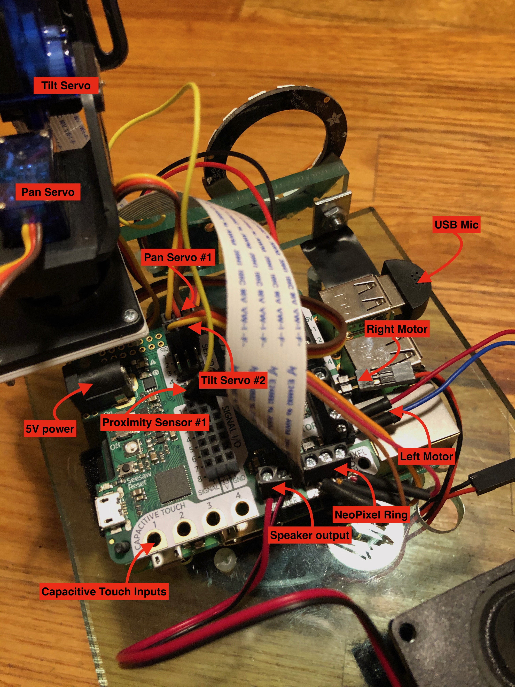

# Hardware - Version 3 - 2020

[BACK TO MAIN DOCUMENTATION TOC](README.md)
________________
<!-- TOC START min:2 max:5 link:true asterisk:false update:true -->
- [VERSION 3 HARDWARE (2020+)](#version-3-hardware-2020)
  - [Description](#description)
  - [Hardware Parts list](#hardware-parts-list)
  - [Hardware Assembly](#hardware-assembly)
    - [Prepare the electronics](#prepare-the-electronics)
    - [Assemble the robot platform](#assemble-the-robot-platform)
    - [Connect parts together](#connect-parts-together)
  - [Installing Delft AI Toolkit software](#installing-delft-ai-toolkit-software)
    - [Computer](#computer)
      - [Free Unity Software](#free-unity-software)
      - [Delft AI Toolkit Unity Project](#delft-ai-toolkit-unity-project)
    - [Robot](#robot)
      - [Raspberry Pi - Disk Image](#raspberry-pi---disk-image)
<!-- TOC END -->

<br>

## VERSION 3 HARDWARE (2020+)
### Description
The physical robot is currently based on a simple metal robot platform from Adafruit combined with a Raspberry Pi to perform the local edge AI, local text-to-speech, and to make use of cloud APIs. The RPi uses a "hat" for working with sensors, actuators, LEDs (Neopixels), DC wheel motors and Servos. The robot RPi communicates with Unity running on a computer with the OSC network protocol over WiFi.

### Hardware Parts list
* **BODY**
  * [Metal Robot Platform](https://www.adafruit.com/product/3796)
  * [2 motors for wheels](https://www.adafruit.com/product/3777)
  * [2 wheels](https://www.adafruit.com/product/3757)
  * [ball caster](https://www.adafruit.com/product/3948)
* **CPU**
  * [Raspberry Pi 4 B+, 2GB](https://www.adafruit.com/product/4292)
  * [Adafruit CRICKIT Hat](https://www.adafruit.com/product/3957)
* **CAMERA**
  * [Pi Camera](https://www.adafruit.com/product/3099)
  * [8" camera cable](https://www.adafruit.com/product/1647) (the standard cable is not long enough)
  * [camera case](https://www.adafruit.com/product/3253)
  * [camera focus tool](https://www.adafruit.com/product/3518)
* **SENSORS/ACTUATORS**
  * [USB Mic](https://www.adafruit.com/product/3367)
  * [Speaker](https://www.adafruit.com/product/3351)
  * [NeoPixel 16 Light Ring](https://www.adafruit.com/product/2854)
  * [Ultrasonic Proximity Sensor](https://www.adafruit.com/product/172)
  * [Pan/Tilt Servo Kit as camera mount](https://www.adafruit.com/product/1967)
* **POWER**
  * [USB 5V 2A Rechargeable Battery for RPi](https://www.amazon.com/Anker-Upgraded-Candy-Bar-High-Speed-Technology/dp/B06XS9RMWS/ref=sr_1_20)
  * [USB to 2.1mm Male Barrel Jack Cable](https://www.adafruit.com/product/2697) (connects battery to CRIKIT which powers both CRICKIT and RPi)

In addition to the above, the robot uses screws, standoffs, and [velcro](https://www.amazon.com/Monoprice-Hook-Loop-Fastening-0-75-inch/dp/B004AF9II6/) for mounting all the components
* [NeoPixel Diffuser](https://www.tinkercad.com/things/hJRIqCVGwtZ) - fits over the NeoPixel Ring and helps diffuse the light

### Hardware Assembly

<br>

#### Prepare the electronics
  * Create a Deflt AI Toolkit SD card for the RPi (see below)
  * For audio to work correctly on on older CRICKIT boards, you **[may need to cut a small trace](https://learn.adafruit.com/adafruit-crickit-hat-for-raspberry-pi-linux-computers/speaker-output)** on the bottom of the CRICKIT circuit board (see photo below)
  <br><br>
  * Install the camera ribbon cable, feeding it through the CRIKIT camera cable cable hole. Connect to the RPi camera connector (blue side of the cable facing the Ethernet jack - watch [this video](https://www.youtube.com/watch?v=lAbpDRy-gc0)), then connect the cable to the Camera
  * Carefully install the CRICKIT on the RPi using the included extension pins while keeping the camera cable plugged in
  * Plug the mic into the RPi upper left USB plug

#### Assemble the robot platform
  1. see also [this page for a similar project with details/photos](https://learn.adafruit.com/circuitpython-ble-crickit-rover/build-the-rover)
  1. Mount the motors, then attach the wheels to the motors
  1. Attach the ball caster to the bottom front of the platform
  1. Use double faced tape to mount the pan/tilt servo assembly to the front top of the Platform
  1. Mount the RPi with CRICKIT installed onto the top of the platform using velcro - mount it sideways so the USB plugs face toward the right wheel - be sure mount it so an ethernet cable can be plugged in next to the wheel
  1. Mount the speaker underneath the platform, facing up, with velcro or double faced tape

#### Connect parts together
  * Solder the connection wires and mount the Neopixel ring and Ultrasonic sensor on the front, then connect the wires to the CRICKIT, routing them through the platform
  * Connect the pan/tilt servos to the servo ports (pan 1, tilt 2) on the CRICKIT
  * Connect the two DC motors to the motor ports on the CRICKIT - connect the black wires to the inner pins next to the GND outlet - [Diagram](https://learn.adafruit.com/adafruit-crickit-creative-robotic-interactive-construction-kit/circuitpython-dc-motors#step-3002673) - You may need to use use male-to-male header pins/jumpers to connect.
  * Connect the Proximity sensor to CRICKIT - I/O port row 1: Signal to Signal, power to 3.3V, Ground to GND
  * Connect the NeoPixel Ring to the CRICKIT NeoPixel connections, 5V, signal, ground
  * Attach the speaker to CRICKIT Hat
  * Mount the USB battery pack to the back side of the platform using Velcro, and attach a short USB A to 2.1mm Male Barrel Jack cable from the battery to the CRICKIT
  * Follow the startup sequence on the [main page](../README.md)

<br><br>
<br><br>
<br><br>
<br><br>

<br>Hardware version 2 - 2019

### Installing Delft AI Toolkit software

#### Computer
##### Free Unity Software
* **Install [Unity3D](https://store.unity.com)** The toolkit is tested with Unity3D v2019.3.x
##### Delft AI Toolkit Unity Project
* **Download the toolkit software** .zip file from our [Releases](../releases/) page, uncompress, and place on your computer. This includes the Unity project, RPi code, and documentation
* Open the toolkit in Unity - use Open from within Unity and select **delft-toolkit-2_0_3>Unity>delft-toolkit**
* **NOTE**: If you chose to clone or download the software from the main GitHub page, note that we use xNode, IBM Watson SDK, and IBM SDK Core as a submodules (i.e. we use the code from the original repos). With a simple clone, the submodule code will be missing from this Unity project directory: delft-toolkit>Assets>Scripts>delftToolkit>Submodules>
     <br>There are several solutions for this:
     * **Download a Release** - At significant version points, we upload a complete version as a [release](../releases/) that includes the appropriate version of xNode. As mentioned above, this is the recommended method.
     * **Git Clone With Submodules From Command Line** - Use the following terminal command to clone the entire repo with the submodules included:
     ```bash
     git clone --recurse-submodules https://github.com/pvanallen/delft-ai-toolkit.git
     ```
     * **Download** - After you download the toolkit from GitHub with the download button, go to the [xNode repo](https://github.com/Siccity/xNode) (or other submodules) and download the code yourself. Then place the xNode folder (or other submodules) in the toolkit Unity project at delft--ai-toolkit>unity>delft-toolkit>Assets>Scripts>delftToolkit>Submodules>xNode

#### Robot

##### Raspberry Pi - Disk Image
* **Command Line Only** - NOTE: This disk image is derived from the "Lite" version of Raspbian, and therefor does not have the GUI windows software installed. This means you cannot use the visual desktop on a monitor.
* Download the 2021-03-10 [RPi disk image](https://www.dropbox.com/s/u28213ondujpf0k/delft-toolkit-2021-03-10.dmg?dl=0)
* Use a 32GB Micro SD card, ideally it should be a Class 10 for optimal speed. We've had good luck with the [SanDisk Evo Plus 32](https://www.amazon.com/Samsung-Class-Micro-Adapter-MB-MC32GA/dp/B07NP96DX5/ref=sr_1_14)
* Copy the disk image to the card ([more info for Mac and Windows](https://thepihut.com/blogs/raspberry-pi-tutorials/17789160-backing-up-and-restoring-your-raspberry-pis-sd-card)). On the Mac Terminal:
  ```bash
  # get the name of the correct drive (look for one that is Windows_FAT_32 and 31.9 GB)
  diskutil list
  # unmound the disk (change "N" at the end to the correct number)
  diskutil unmountDisk /dev/diskN
  # write the image (change the .dmg filename to the current version
  # change "N" in rdiskN to the correct number from diskutil)
  sudo dd if=delft-toolkit-2021-03-10.dmg of=/dev/rdiskN bs=5m
  ```
* Plug the SD card into the RPI, and then power the RPi up
* Setup the WiFi: Connect your computer to the RPI with ethernet and login:
  ```bash
  ssh pi@delftbt0.local
  # password: adventures
  # once logged in, edit the RPi WiFi configuration with your WiFi credentials
  sudo nano /etc/wpa_supplicant/wpa_supplicant.conf
  # reboot for the new WiFi to take effect
  sudo poweroff
  # disconnect the Ethernet cable and remove and replace the power to boot
  # log back in, and confirm the WiFi has connected on wlan0
  ssh pi@delftbt0.local
  # on RPI, check the IP address for wlan0
  ifconfig
  ```
* If you are using more than one robot on your network, [change the RPi hostname](https://carmalou.com/how-to/2017/08/06/how-to-change-hostname-for-raspberry-pi.html) from the default of delftbt0 (e.g. to delftbt1, delftbt2, delftbt3, etc.)
