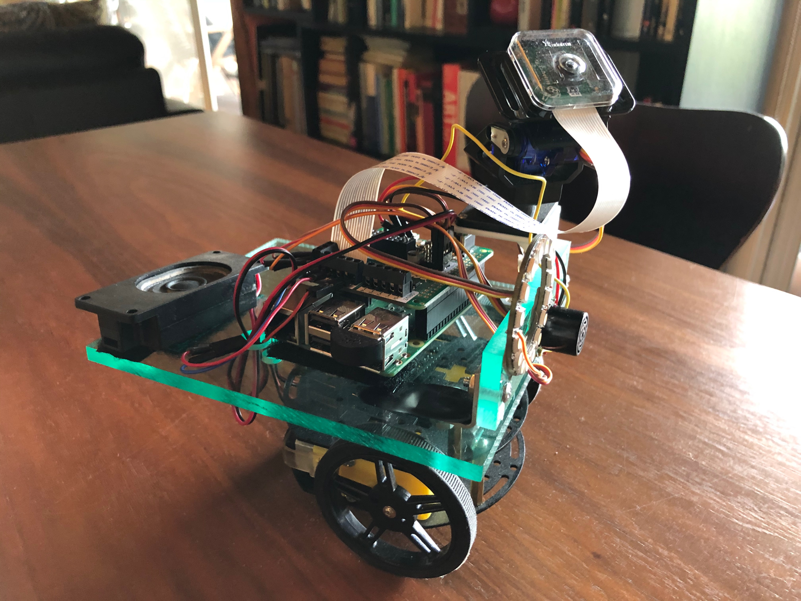
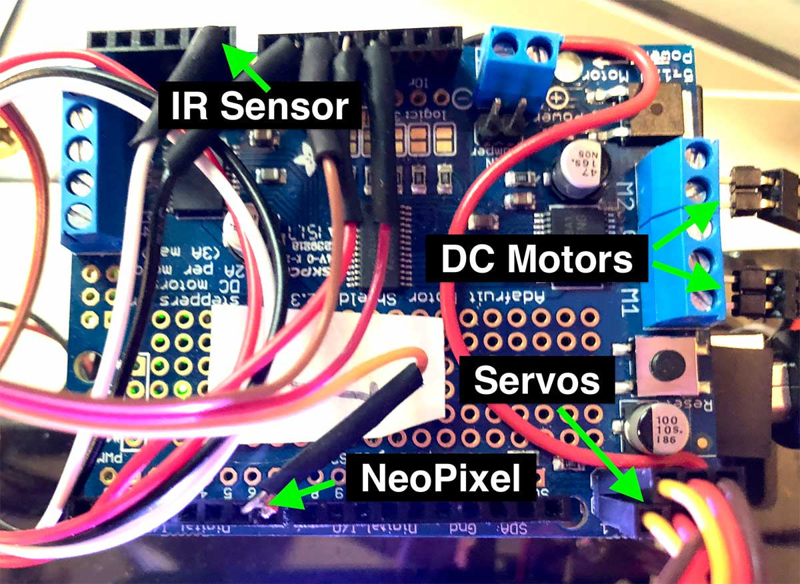
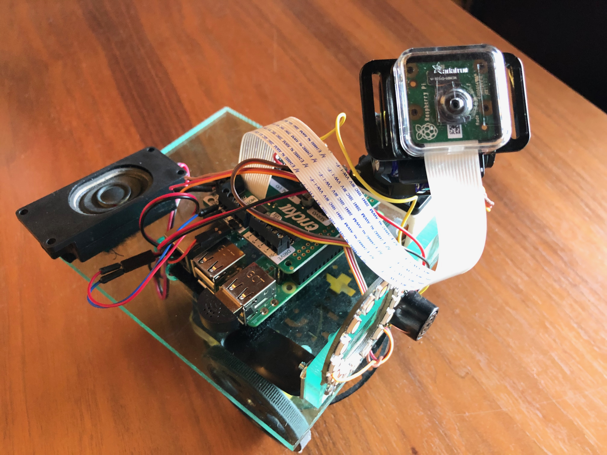
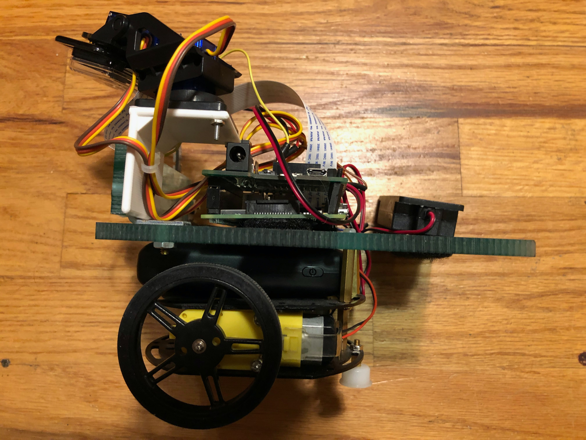

# Hardware
The physical robot is currently based on a simple metal robot platform from Adafruit combined with a Raspberry Pi to perform the local edge AI, local text-to-speech, and make use of cloud APIs. The RPi talks over serial to an Arduino with a motor hat for the DC motors and Servos. The robot RPi communicates with Unity running on a computer with the OSC network protocol over WiFi.

Note: The next hardware version planned will eliminate the Arduino and replace it with the Adafruit [Crickit Hat](https://www.adafruit.com/product/3957) for the RPi. This will simplify hardware and software, and make a more compact robot.
________________
<!-- TOC START min:2 max:4 link:true asterisk:false update:true -->
- [Hardware Parts list](#hardware-parts-list)
- [Hardware Assembly](#hardware-assembly)
- [Installing Delft AI Toolkit software](#installing-delft-ai-toolkit-software)
  - [Computer](#computer)
    - [Free Unity Software](#free-unity-software)
    - [Delft AI Toolkit Unity Project](#delft-ai-toolkit-unity-project)
  - [Robot](#robot)
    - [Arduino - Sketch](#arduino---sketch)
    - [Raspberry Pi - Disk Image](#raspberry-pi---disk-image)
<!-- TOC END -->



## Hardware Parts list
* [Robot Platform Kit](https://www.adafruit.com/product/3244)
* [Raspberry Pi](https://www.adafruit.com/product/3775)
* [Pi Camera](https://www.adafruit.com/product/3099) & [8" camera cable](https://www.adafruit.com/product/1647)
* [Seeed ReSpeaker Microphone Hat](https://us.seeedstudio.com/ReSpeaker-2-Mics-Pi-HAT-p-2874.html)
* [Arduino or Equivalent](https://www.sparkfun.com/products/11021)
* [Motor Shield for Arduino](https://www.adafruit.com/product/1438)
* [Speaker](https://www.adafruit.com/product/3351)
* [NeoPixel 12 Light Ring](https://www.adafruit.com/product/1643)
* [IR Sensor](https://www.adafruit.com/product/164)
* [Pan/Tilt Servo Kit](https://www.adafruit.com/product/1967)
* [USB 5V 2A Rechargeable Battery for RPi](https://www.amazon.com/Anker-PowerCore-Ultra-Compact-High-Speed-Technology/dp/B01CU1EC6Y/)
* [4 AA Battery Holder for Motor Shield](https://www.adafruit.com/product/830)
* [Short USB A to Micro Cable - Battery to RPi](https://www.amazon.com/Micro-USB-Cable-Select-Models/dp/B01FSYBQ9Q/)
* [USB A to USB B Cable - RPi to Arduino](https://www.amazon.com/Inovat-Printer-Cable-USB-Scanner/dp/B01HB91CRM/)

In addition to the above, the robot uses a couple pieces of plexiglass (or other appropriate material) for mounting all the components. It also uses a 3D printed "L" bracket to mount the pan/tilt servos, and a 3D printed light diffuser to cover the NeoPixel ring
* 8"x5" main platform - mounted as the top layer instead of the circular metal plate supplied with the Adafruit robot kit
* 2"5" front plate - used to mount the RPi camera, NeoPixel, and IR sensor
* ["L" bracket](https://www.tinkercad.com/things/ikA8s2YAOyl) - 3D printed part used to mount the pan/tilt servos
* [NeoPixel Diffuser](https://www.tinkercad.com/things/hJRIqCVGwtZ) - fits over the NeoPixel Ring and helps diffuse the light

## Hardware Assembly

* [Assemble the robot platform](https://learn.adafruit.com/tri-layer-mini-round-robot-chassis-kit) - see also [this page for a similar project with details/photos](https://learn.adafruit.com/curiebot-arduino-101-mini-robot-rover/assembling-and-wiring-your-robot)
  * Be sure to mount the motors between the bottom and middle layers
  * Leave off the top (3rd) layer (will be replaced by the plexiglass platform)
  * When screwing on the second layer, mount the metal standoffs in locations that leave an opening in the front so the 4 AA batter holder can slip in and out
  * Attach the 5"x8" plexiglass platform as the top layer
  * Use small metal L brackets to attach the 2"x5" front plate to the top layer
  * If you are using the pan/tilt servos, 3D print the "L" mount for them and attach it to the front plate on one side, and mount the pan/tilt on top of the "L" mount
* Prepare the electronics
  * [Assemble the motor shield](https://learn.adafruit.com/adafruit-motor-shield-v2-for-arduino), cutting the servo power trace, and connecting the servo power jumper - [detailed info](https://learn.adafruit.com/curiebot-arduino-101-mini-robot-rover/assembling-and-wiring-your-robot#servo-power-3-74). You want the servos to be powered by the battery, not the USB from the RPi
  * Plug the motor shield into the Arduino. To prevent shorts, first put a small piece of electrical tape on top of the USB port
  * Connect your computer to the Arduino, and upload the [delftToolkit.ino](https://github.com/pvanallen/delft-toolkit-v2/tree/master/arduino/delftToolkit) software
  * Create a Deflt AI Toolkit SD card for the RPi (see below)
  * Install the Seeed ReSpeaker Microphone Hat on the RPi
  * Mount the assembled Arduino and RPi on the platform next to each other (velcro is handy for this rather than screws) and connect them together with the USB cable
* Connect parts together
  * Mount the Neopixel ring, IR sensor, and pan/tilt servos on the front
  * Connect the pan/tilt servos to the two servo ports on the motor controller
  * Connect the two DC motors to the motor ports on the motor controller
  * Connect the IR sensor to Arduino: analog in port 0, GND, 5V
  * Connect the NeoPixel: Digital port 6, GND, 3.3V
  * Lengthen the AA battery holder wires by 3 inches, and attach them to the power input of the motor shield. Put some small rubber feet on the bottom of battery pack so it can be friction fit and slipped between the top and middle layers of the robot.
  * Attach the speaker to the Seeed Hat
  * Mount the USB battery pack underneath the main platform with velcro, and attach the short USB A to Micro USB cable to the battery (don't power the RPI until ready)
* Follow the startup sequence on the [main page](../README.md)





## Installing Delft AI Toolkit software

### Computer
#### Free Unity Software
* **Install [Unity3D](https://store.unity.com)**
* The toolkit is compatible with Unity3D v2018.2.x and v2018.3.x
#### Delft AI Toolkit Unity Project
* **Download the toolkit software** from our [Releases](../releases/), and place on your computer. This includes the Unity project, RPi code, and Arduino code
* Open the toolkit in Unity - use Open from within Unity and select **delft-toolkit-2_0_3>Unity>delft-toolkit**
* **NOTE**: If you chose to clone or download the software from the main GitHub page, note that we use xNode, IBM Watson SDK, and IBM SDK Core as a submodules (i.e. we use the code from the original repos). With a simple clone, the submodule code will be missing from this Unity project directory: delft-toolkit>Assets>Scripts>delftToolkit>Submodules>
     <br>There are several solutions for this:
     * **Download a Release** - At significant version points, we upload a complete version as a [release](../releases/) that includes the appropriate version of xNode. As mentioned above, this is the recommended method.
     * **Git Clone With Submodules From Command Line** - Use the following terminal command to clone the entire repo with the submodule included:
     ```bash
     git clone --recurse-submodules https://github.com/pvanallen/delft-toolkit-v2.git
     ```
     * **Download** - After you download the toolkit from GitHub with the download button, go to the [xNode repo](https://github.com/Siccity/xNode) (or other submodules) and download the code yourself. Then place the xNode folder (or other submodules) in the toolkit Unity project at delft-toolkit-v2>unity>delft-toolkit>Assets>Scripts>delftToolkit>Submodules>xNode

### Robot

#### Arduino - Sketch
* Install delftToolkit.ino on your Robot Arduino with the Arduino IDE (you may need to add some libraries, e.g. the [Adafruit Motor Shield V2 Library](https://learn.adafruit.com/adafruit-motor-shield-v2-for-arduino/install-software))

#### Raspberry Pi - Disk Image
* **Command Line Only** - NOTE: This disk image is derived from the "Lite" version of Raspbian, and therefor does not have the GUI software installed. This means you cannot use the visual desktop on a monitor.
* Download the 2019-05-16 [RPi disk image](https://www.dropbox.com/s/o62yycnodb7ppho/delft-toolkit-2019-05-16.zip?dl=0)
* Use a 16GB Micro SD card, ideally it should be a Class 10 for optimal speed. We've had good luck with the [SanDisk Ultra](https://www.amazon.com/SanDisk-Ultra-Micro-Adapter-SDSQUNC-016G-GN6MA/dp/B010Q57SEE)
* Copy the disk image to the card ([more info for Mac and Windows](https://thepihut.com/blogs/raspberry-pi-tutorials/17789160-backing-up-and-restoring-your-raspberry-pis-sd-card)). On the Mac Terminal:
  ```bash
  # get the name of the correct drive (look for one that is Windows_FAT_32 and 15.9 GB)
  diskutil list
  # unmound the disk (change "N" at the end to the correct number)
  diskutil unmountDisk /dev/diskN
  # write the image (change the .dmg filename to the current version
  # change "N" at in rdiskN to the correct number from diskutil)
  sudo dd if=delft-ai-toolkit-2019-04-04.dmg of=/dev/rdiskN bs=5m
  ```
* Plug the SD card into the RPI, and then power it up
* Setup the WiFi: Connect your computer to the RPI with ethernet and login:
  ```bash
  ssh pi@delftbt0.local
  # password: adventures
  # once logged in, edit the RPi WiFi configuration with your WiFi credentials
  sudo nano /etc/wpa_supplicant/wpa_supplicant.conf
  # reboot for the new WiFi to take effect
  sudo reboot
  # log back in, and confirm the WiFi has connected on wlan0
  ssh pi@delftbt0.local
  # on RPI, check the IP address for wlan0
  ifconfig
  ```
* If you are using more than one robot on your network, [change the RPi hostname](https://carmalou.com/how-to/2017/08/06/how-to-change-hostname-for-raspberry-pi.html) from the default of delftbt0 (e.g. to delftbt1, delftbt2, delftbt3, etc.)
