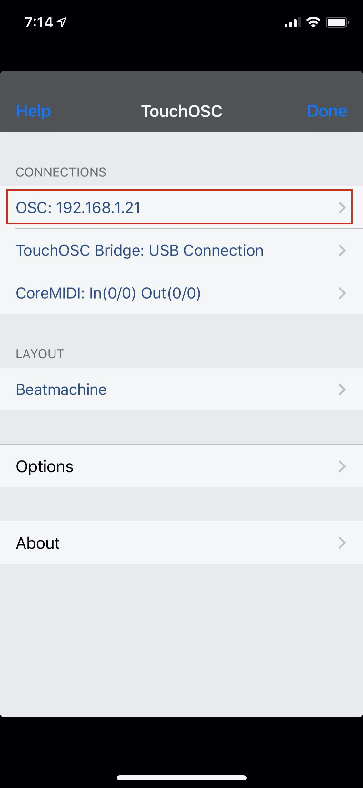
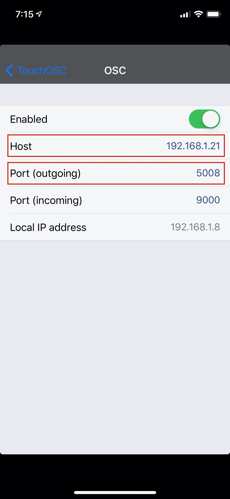
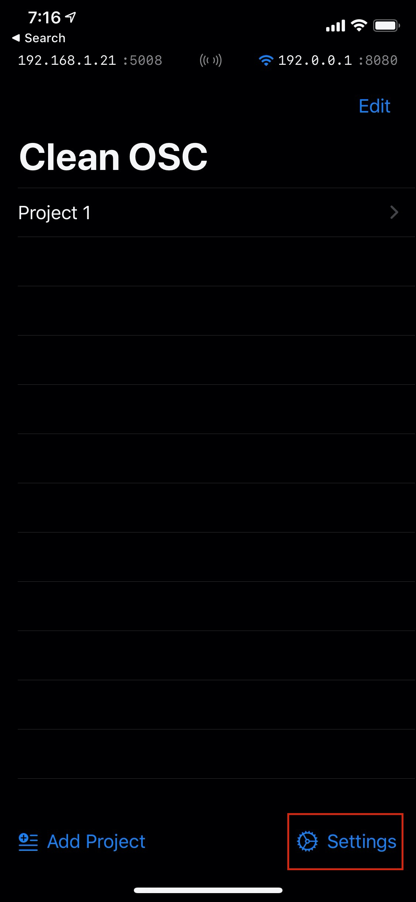
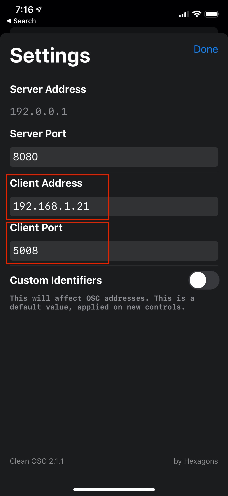
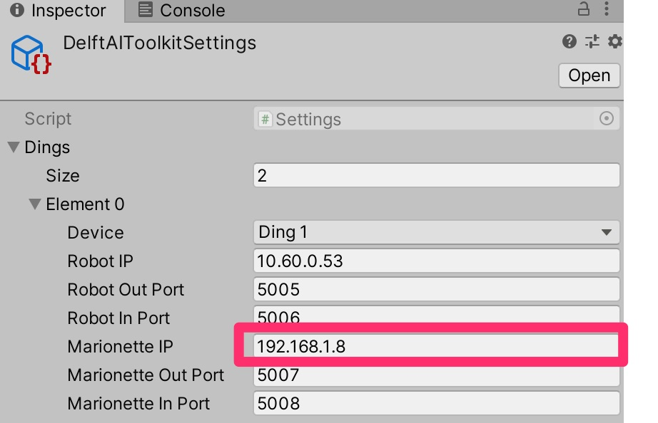
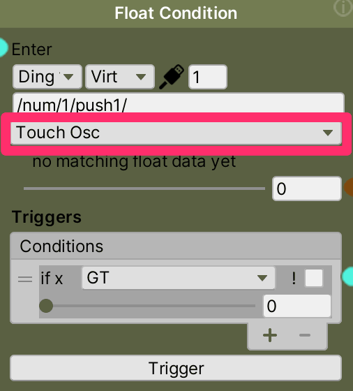
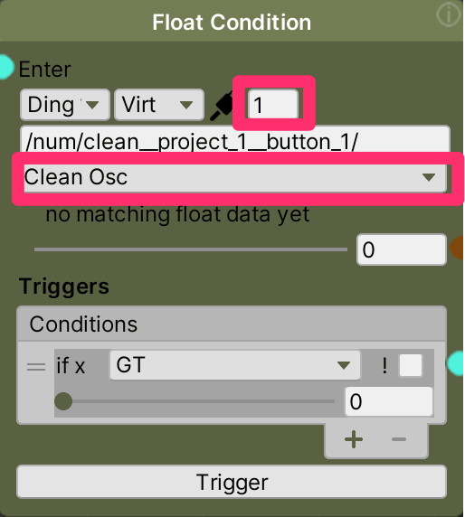

# Working with OSC to marionette

OSC is a network protocol the toolkit uses for communication between Unity and the robot. In addition, it can be optionally used to marionette (or Wizard of Oz) your project. By sending OSC commands to the toolkit project in Unity, you can trigger certain actions that are already set up in your toolkit graph. To do this, you'll need an application to generate OSC commands. For example, you can create a patch in [Max/MSP](https://cycling74.com/products/max/) or [Logic Pro](https://www.apple.com/logic-pro/). We recommend a mobile app such as:

* [TouchOSC](https://hexler.net/products/touchosc) $5, works on both iOS and Android, and is very configurable in creating an interface
* [CleanOSC](https://cleanosc.app/) free, iOS only, has a very minimal interface

[BACK TO MAIN DOCUMENTATION TOC](README.md)
_______________
<!-- TOC START min:2 max:3 link:true asterisk:false update:true -->
- [Configure OSC](#configure-osc)
  - [Set up the OSC application](#set-up-the-osc-application)
  - [Set up the Toolkit](#set-up-the-toolkit)
- [Use your app to send OSC to the toolkit](#use-your-app-to-send-osc-to-the-toolkit)
- [Other notes about OSC messages](#other-notes-about-osc-messages)
<!-- TOC END -->
_______________

## Configure OSC

### Set up the OSC application

* In the OSC app, set the IP address and Port (5008) of your computer running Unity
* In TouchOSC this is under Settings (dot in lower right)>Connections/OSC/Host and Port (outgoing)
* In CleanOSC this is in Settings under Client Address and Client Port

 br>  
 br> 

### Set up the Toolkit

* In the toolkit, set the IP address of your mobile device in Delft Toolkit>Show Settings>Ding1>Marionette IP
  * Note: the Marionette ports are standardized in the toolkit. Any OSC commands you send to the toolkit should be to the computer IP running Unity, and PORT 5008 (ding1) and PORT 5012 (ding2). The Marionette OUT Ports are not currently used.
* In the String Condition node, you'll also need to set the appropriate app type, and button number (in the port field)
* OR, you can the the OSC message to anything your app sends by selecting ANY from the dropdown.
* Also in the condition node, set up a **Trigger Condition** to capture the value you want to respond to. Typically the app will send a "1" when the button is pressed, and "0" when the button is released. So for example, you can create a trigger condition that looks for a value greater than zero to trigger the action you want taken when the button is pressed.
* SEE the OSCMarionette example graph in the toolkit for an example

br>  
   

## Use your app to send OSC to the toolkit
* Send OSC commands
  * In TouchOSC select the **Beatmachine Layout**, and touch upper left button "1" of the 3x3 grid. When you touch a button, it will send an OSC message like this, where the number at the end of "push" is button number:
    * **/1/push1/**
  * In CleanOSC, within Project 1, **Add a Control** of type Button. Note the identifier, which will determine the OSC message it sends. When you touch "send" for a button, it will send an OSC message like this, where the number at the end is the button number:
    * **/clean__project_1__button_1/**
  * Note that the toolkit will add on a "/num" to the beginning of any incoming OSC message so the resulting messages will look like:
    * **/num/1/push1/**
    * **/num/clean__project_1__button_1/** (note the double underlines after clean and project_1)
  * Note also that OSC typically puts the value after the url message, for example:
    * **/num/1/push1/ 1**

## Other notes about OSC messages
* You can see an incoming message just below the Float Condition type
* You also accept any incoming message that starts with a particular sequence. For example, if you select the type of "ANY", put in just **/num/** to accept any message sent by another app. Once you've seen the kind of message your app is sending, you can then narrow down what kinds of messages you want to process with this condition.
