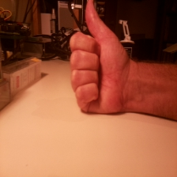
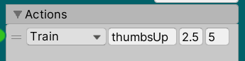
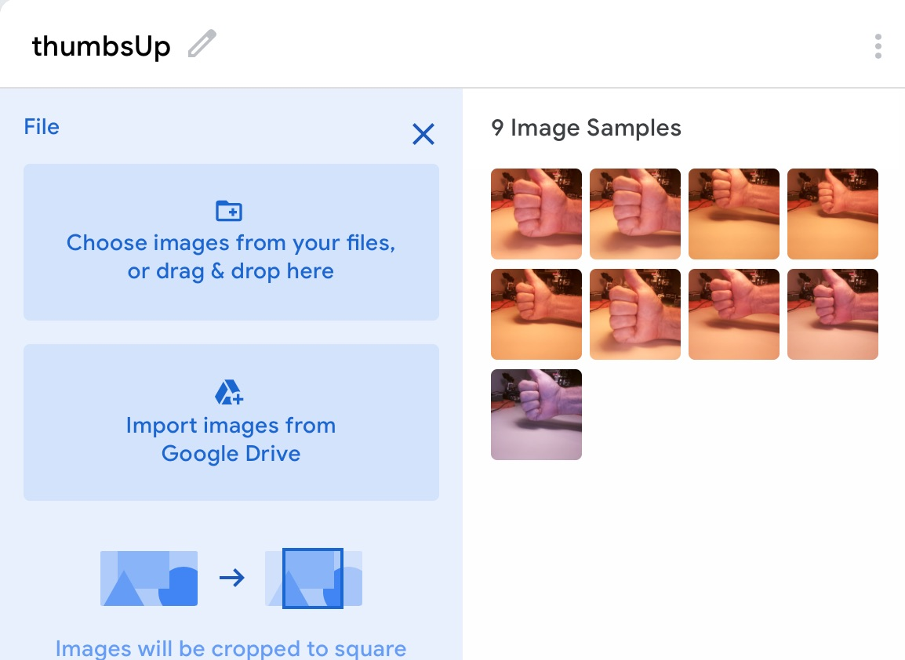
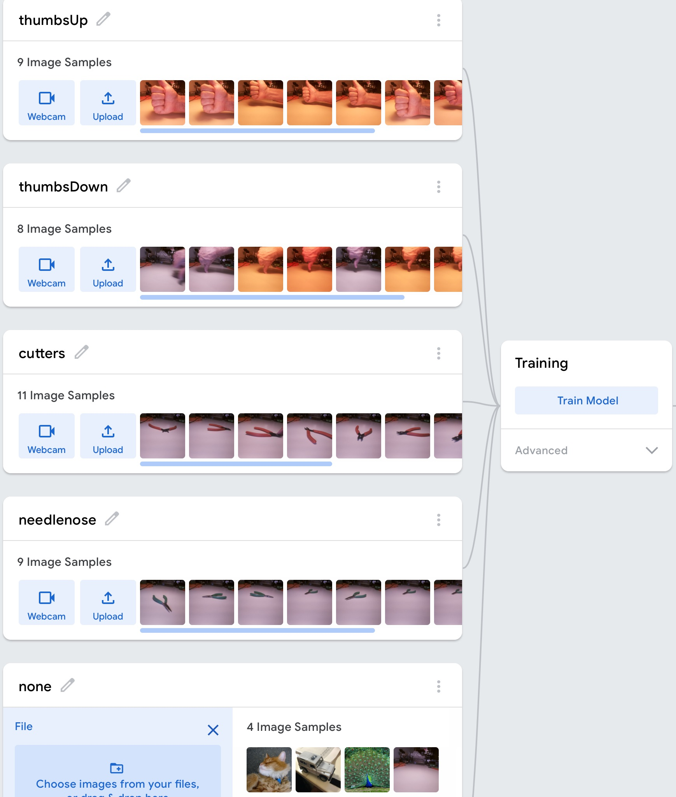
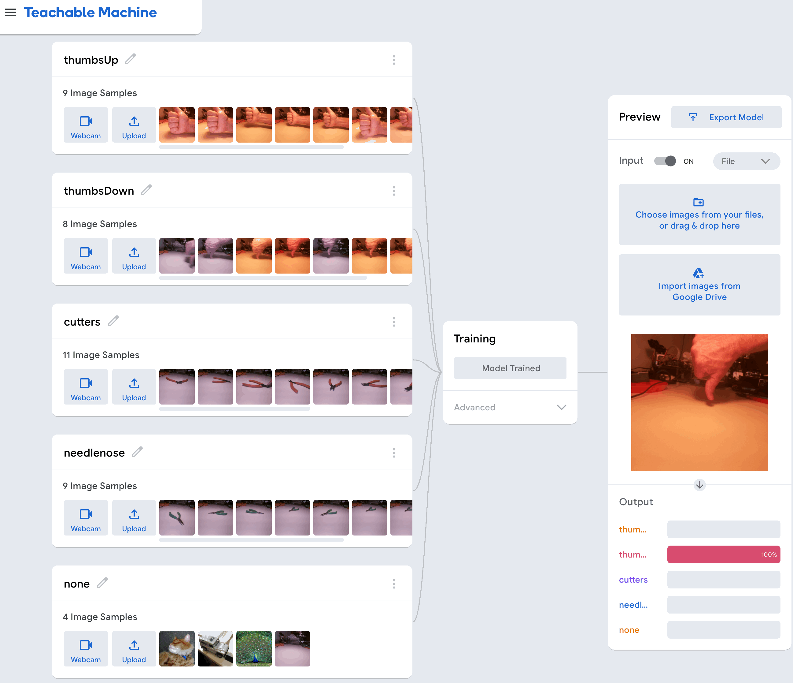
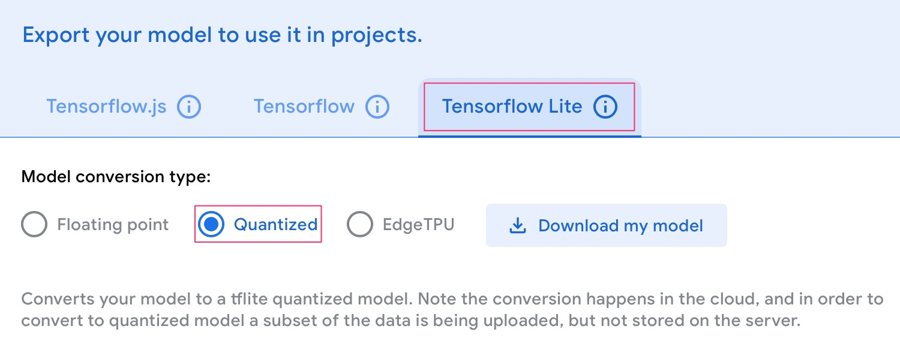
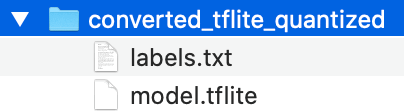
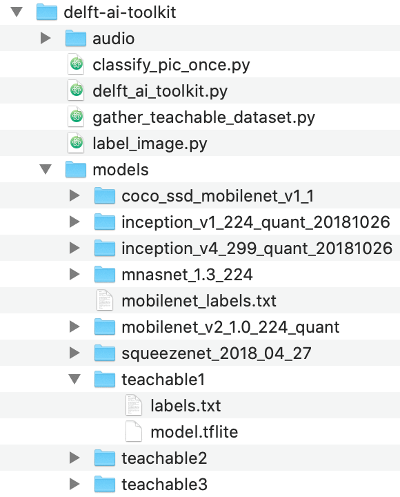
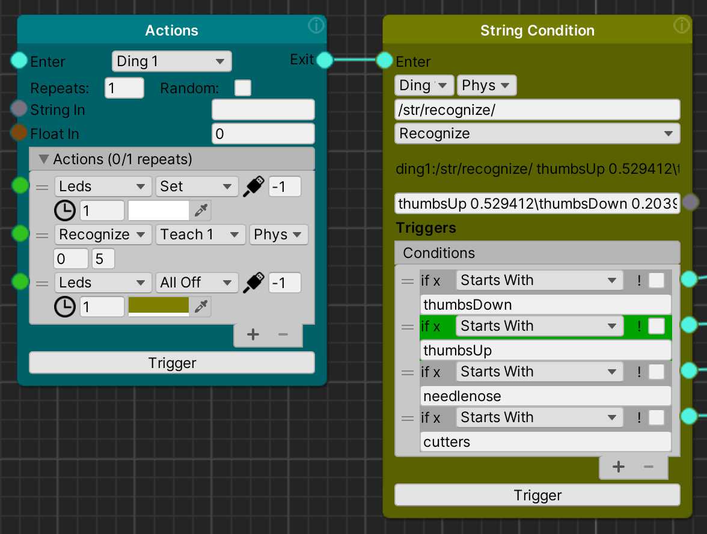
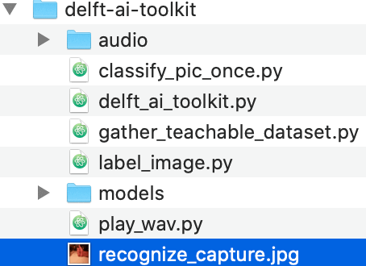

# Training for Teachable Machine Object Detection

In the toolkit version 3.1.0, it is possible to use a custom, user created object detection model with the [recognize action](action.md#recognize---perform-object-recognition-from-the-robot-camera-or-by-tag-in-the-unity-virtual-environment). This model is created in the easy-to-use [Teachable Machine](https://teachablemachine.withgoogle.com) web tool, and then installed on the robot for "edge" execution using TensorFlow Lite.
_________________
<!-- TOC START min:2 max:4 link:true asterisk:false update:true -->
- [Object Detection/Recognition Overview](#object-detectionrecognition-overview)
- [OVERVIEW: Model creation and implementation process](#overview-model-creation-and-implementation-process)
- [Identify categories/classes](#identify-categoriesclasses)
- [Capture and Archive](#capture-and-archive)
  - [Creating a high quality dataset](#creating-a-high-quality-dataset)
    - [Image quality](#image-quality)
    - [Image Diversity](#image-diversity)
  - [Use the TRAIN action to capture multiple images](#use-the-train-action-to-capture-multiple-images)
  - [Archive the images to your computer, and set aside "test" images](#archive-the-images-to-your-computer-and-set-aside-test-images)
- [Create the Model by Uploading & Training on Teachable Machine](#create-the-model-by-uploading--training-on-teachable-machine)
  - [Define each Category and upload Images](#define-each-category-and-upload-images)
    - [Train the model](#train-the-model)
  - [Test the model](#test-the-model)
  - [Export & Download the Model](#export--download-the-model)
  - [Install the Model](#install-the-model)
  - [Test on the RPi](#test-on-the-rpi)
<!-- TOC END -->
_________________
## Object Detection/Recognition Overview
Choosing an appropriate model for machine learning is crucial for the success of your project. The Toolkit provides several pre-built models that are trained with generic image datasets, such as [ImageNet](http://www.image-net.org). These include the mobilenet, squeezenet, and two inception models. While these work fine for certain applications, your project may require a model trained specifically for the kinds of objects you need detected. For example, your application might require that the robot recognize when a person gives a "thumbs up" hand signal such as:

 

The off-the-shelf models identified this hand signal as everything from a "can opener" to a "syringe", so they would not be a good choice. Rather than using a pre-built model, creating your own ML model is a great chance to learn about the process of collecting a quality dataset, training a model, testing the model, and experience the model perform in the real world. In this way, you can better understand and design for the particular characteristics of machine learning.

The Toolkit provides a simple way for you to create and use such a custom model. To do this, we utilize the free [Teachable Machine](https://teachablemachine.withgoogle.com) system built with Google.

## OVERVIEW: Model creation and implementation process
1. ***Define each different Category*** - Compile a list of each different category of object you want to recognize.
1. ***Capture and Archive*** - Capture a series of prototypical images from the Raspberry Pi camera for each category of object to be detected, then archive the category image sets (e.g. 15 or more varied images of the thumbs up) on your computer
1. ***Create the Model by Uploading & Training on Teachable Machine*** - Using the [Teachable Machine](https://teachablemachine.withgoogle.com) website
  1. ***Create each Category*** - Select and upload a subset of the images for each category to use as a training dataset
  1. ***Train the Model*** - After uploading images for all categories, having the Teachable Machine website process the images and use them to train the model
  1. ***Test the Model*** - Once the model is created, test the model with some category images NOT used for training
  1. ***Export & Download the Model*** - Convert the new model to TensorFlow Lite, quantized format
1. ***Install the Model*** - Download the new model and install it on the Raspberry Pi
1. ***Test on the RPi*** - Run the toolkit and test out the new model in real world

## Identify categories/classes
1. ***Define Category Names*** - Compile a list of each different category of object you want to recognize. and gather examples of the objects to capture. Give each category a unique name. E.g. For hand signals: thumbsUp,thumbsDown, etc. For tools: cutters, needlenose, etc.
1. ***Define a None Category*** - It is important to create a ***none*** category, especially in the case where there are only two categories (e.g. thumbsUp and thumbsDown). It helps the ML model to have other categories to make better identifications. For the none category, capture blank, blurry, or other "wrong" images that should be considered to be unimportant. The reason for this is that if you don't have a "none" category, the model may decide that a flat hand is a thumbsUp, since it has no other options to pick from.

## Capture and Archive
### Creating a high quality dataset
The machine learning model you create is only as good as the data you train it with. As the old saying goes, **garbage in, garbage out**.
#### Image quality
* ***Focus*** - Be sure to create a few test images and keep in mind that the Raspberry Pi camera is not perfect. In particular, the focus is fixed and is adjusted mechanically -- there is **no auto-focus!**. So the better focused your images are the better the model will be. Note that by default, the Pi Camera is focused far away - i.e. at infinity. Check this [Pi forum discussion](https://www.raspberrypi.org/forums/viewtopic.php?t=46637) for more information about changing the focus.
* ***Lighting*** - The image quality can be significantly affected by poor lighting. Be sure your subject has enough light on it. Also think about the lighting conditions that will be in play when the application is in use. Indoor or outdoor lighting? Incandescent, LED or florescent lights (which all have different color balances)
* ***Composition*** - The images you capture do not have to be artistic, but they do need to cover the entire object to be detected. So check to see if the thing is too small or cut off because it is too big.

#### Image Diversity
The machine learning model needs to be trained on a range of different examples of each object it will be expected to detect. For example, in our above "thumbs up example", what different hands will be used in your application?

**For hands, CONSIDER**:
* What skin tone do they have?
* What gender or other characteristics do the hands have?
* How aged are the hands?
* Do the hands have nail polish, tattoos, or other ornamentation?
* What different positions, orientations and "postures" of the hands make sense for each different hand signal?
* What does a "thumbs up" look like to different people or cultures?

**In the case of objects (say tools), CONSIDER**:
* What different colors are valid?
* What orientation (e.g. left, right rotation) or states (e.g. open/closed) will the tools be in?
* What surface will they be on?
* What's in the background?

Try to anticipate all the different variations that your project can expect to encounter in the "real world" - and be sure to capture a diverse range of examples that match this diversity.

### Use the TRAIN action to capture multiple images
 
When you initiate the [train](action.md#train---collects-a-series-of-images-from-the-robot-camera-phys-robot-only) action, it will begin a process of capturing images on the RPi into a directory with the name you enter for the category. The first number (e.g. 2.5) specifies the number of seconds it waits between each image. The second number (e.g. 5), specifies how many images to capture (the number you choose depends on how many different variations you need for this category, as discussed above). You could start with capturing 15, and set aside 3 of those for testing.

For each image, the robot will turn on its LEDs, announce which image out of the total it is about to capture, and then count down. E.g. "thumbs up four of five, 3, 2, 1", "thumbs up three of five, 3, 2, 1"

### Archive the images to your computer, and set aside "test" images
After capturing a set of images for each category, connect to your RPi via SFTP or as an SMB network volume (delftbt0.local, pi, adventures). Then, in the /home/pi/delft-ai-toolkit directory you'll find a directory called teachable_machine. Inside this directory will be directories for each category you captured.

Copy these category directories to your computer and archive them. Then, make a new "test" directory for each category, e.g.: thumbsUpTest and move 3 (or 20%) of the original captured image into this directory. These images will be used later for testing your trained model.

## Create the Model by Uploading & Training on Teachable Machine
The [Teachable Machine website](https://teachablemachine.withgoogle.com) allows you to define a series of categories and upload training images for each category. Once a complete dataset is uploaded, you can then "train" the model on these images.
**NOTE**: as you proceed, you must keep the browser tab open in order to prevent losing your work. You can save a project from the drop down menu in the upper left of the page, and this will save the project to Google Drive.
### Define each Category and upload Images
1. Go to the [Create Project](https://teachablemachine.withgoogle.com/train) part of teachable machine, and select Image Project.
1. Name the first category or class of object for detection. Click on the Upload button, and then drag the folder of training images you've selected. They will upload and you can see the images in the interface. 

 
1. Repeat this process for each category of object you have captured training images forum
#### Train the model
1. Once each category is created and images have been uploaded, you are ready to train the model.
1. Click on the "Train" button, and wait. The training process may take some time (a few minutes), depending on the number of images you are working with.
1. At the end of the process, your browser will ask for permission to use the camera. You can deny this.  

 
### Test the model
1. At this point, your model is created and in the cloud. You can test the model by giving it images that were not used for training - you should have separated out a subset of your original captured images to use for testing.
1. In the interface, select "File" (vs. Webcam) as the source of your test image, and a few test images and see how your model does 

 
### Export & Download the Model
1. To download the model for use on your robot, click on the **Export Model** button
1. In the next dialog, select "Tensorflow lite", and then "Quantized" 
 
1. Click on "Download my model" to create a local copy of the model. This may take several minutes to convert the model to TensorFlow Lite, quantized format - be patient and don't click away from the browser tab.
### Install the Model
1. Once you've un-zipped the model files, you'll have a folder (converted_tflite_quantized) with two files: 
 
1. To install your custom model on the robot, you'll need to transfer these files to the Raspberry Pi using SFTP or file sharing (delftbt0.local, pi, adventures)
1. On the RPi, you'll find a folder delft-ai-toolkit/models where each supported model has it's associated files. There are three "teachable" folders, that allow you to have three different custom models. Place the new files you just downloaded into one of these folders, replacing what's there. 
 
1. Note which folder you place the files in, as this will determine how you invoke the model in the toolkit action. For example, teachable1 will be run using the "teach1" model, teachable2 is "teach2" etc. 

### Test on the RPi
Be sure your robot is properly set up and communicating with the toolkit in Unity 

1. On any toolkit graph in Unity, create an **Action** node, and connect it's output to a **String Condition** node. Set one of the actions to Recognize, and set the model to your custom teachable model, e.g. "teach1". Set both nodes to "phys" to ensure they interact with the physical robot 
 
1. Point the camera at the object you are testing on and initiate the recognize action. Check the resulting image to make sure lighting and camera direction are okay. To check the image, connect to the Raspberry Pi and find the image in /home/pi/delft-ai-toolkit/recognize_capture.jpg 
 
1. The message from robot after running the model is composed of a series of categories paired with their confidence number. Each category pair, in order of confidence, is separated by a "\\". For instance, here is a response using our example model:

  `thumbsUp 0.529412\thumbsDown 0.203922\needlenose 0.133333\none 0.121569\cutters 0.015686\`

1. To limit the number of category/confidence pairs, set the threshold in the recognize action between 0.0 to 1.0. Only categories with a confidence greater than this number will be included.
