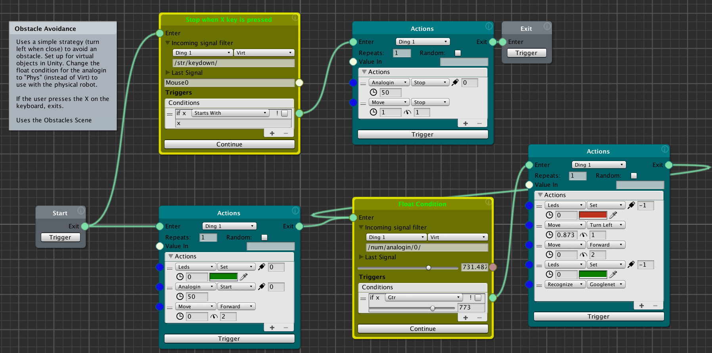
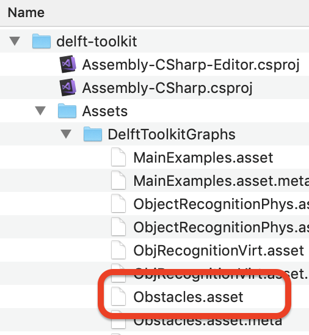

# Toolkit Basics

The Delft AI Toolkit works by connecting together a series of nodes to form a "node graph" which visually shows the logic and function of the project. In most cases, control passes from one node to the next when previous node completes its task (behavior trees). Active nodes are visually highlighted. In other cases, data is sent from one node to the next in a continuous way (data flow).

Action nodes are special in that once control is passed to them, they run a sequence of actions one after the other, until all of them are completed, after which action passes on to the next node. This allows a discrete sequence of actions (that will always be run together) to be represented in a single object rather than a series of nodes.

The toolkit allows for multiple threads of nodes to run in parallel simply by having one node pass control on to more than one next node. So for example, two separate devices can perform actions at the same time in response to a common condition (a light and a fan turn on at the same time when a sensor detects a person).
_______________
<!-- TOC START min:2 max:3 link:true asterisk:false update:true -->
- [Basic Usage](#basic-usage)
  - [Working With Graphs](#working-with-graphs)
  - [Graph Structure](#graph-structure)
  - [Saving a graph](#saving-a-graph)
- [Example Projects](#example-projects)
  - [MainExamples - Four Introductory Graphs](#mainexamples---four-introductory-graphs)
  - [Obstacles](#obstacles)
  - [ObjectRecognitionVirt](#objectrecognitionvirt)
  - [ObjectRecognitionPhys](#objectrecognitionphys)
  - [SubGraph and SubGraphTest](#subgraph-and-subgraphtest)
<!-- TOC END -->
_______________

## Basic Usage

### Working With Graphs
* **Open a graph** - Double click on a graph to open it in a pane. This pane can be separate from the main Unity window, or docked to any panel. Be sure you have the corresponding scene open for this graph. Double click on the scene to make it active.
* **Create a graph** - In the project panel, right click and select Create>Delft toolkit. By convention, we use the Assets>DelftToolkitGraphs folder to store all the graphs.
* **Zoom in/out** - Use the scroll wheel, or use a two finger swipe down (bigger) or up (smaller)
* **Drag Graph** - Right click/two finger click, and drag
* **Create Node** - Right click/two finger click, and from the menu Create>NodeType
* **Delete Node** - Select node(s), right click>Remove
* **Rename Node** - Select node, right click>Rename
* **Connect Nodes** - click and drag a cable from an output port (on right side) to an input port (on left side). Node ports can have multiple inputs and outputs.
* **Run Graph** - Put Unity in Play mode, and click on "Trigger" on the **Start** node. Alternatively, to test a single node anywhere in the graph, click "Trigger" on that particular node, and to pass execution to the next node, click on the "Continue" button.

### Graph Structure
Graphs typically begin with a single "Start" node and end with either an "Exit" or "Restart" node (Restart activates the Start node at the beginning of the graph).

It is also possible to make branches and loops anywhere within the loop. In this way, it is possible to repeat sections of the graph, say while a certain condition remains true. In addition, any node can have multiple inputs (so the node can be activated by more than one input node) and multiple outputs (so it can activate more than one output node).

For example, in the below graph, the Float Condition that waits for the robot to get close to an obstacle activates the next Action node to make the turn, and that node connects back to the Condition node to start the process over again.

The parallel "Keydown" condition also waits (also triggered by the "Start" node), and when the user presses the "X" key, the resulting action stops the robot.

### Saving a graph
As you are developing your graph, you should periodically copy the graph file to another location as a backup with a version number. This also allows you to use the graph in a different Unity project.

In particular, if you download a new version of the toolkit, you can simply copy your backup into the DelftToolkitGraphs folder in the project. See the below screen grab to see the location of the graph files.

## Example Projects
The Delft AI Toolkit comes with a set of example projects that are made up of node graphs and matching scenes. These are in:
* Assets>Scenes folder
* Assets>DelftToolkitGraphs folder

### MainExamples - Four Introductory Graphs
Contains four different simple graphs that demonstrate basic concepts. Uses MainExamples scene
  * Sample Actions - Shows how multiple actions can be collected in a single node, and will be executed in sequence.
  * Get Key Down - Uses a condition node to capture key presses, where each different key produces a different motion.
  * Parallel Actions - This shows how two Action nodes can run simultaneously
  * Random Color - Shows how an Action node can be run repeatedly by setting the "Repeats" number. In addition, and Action node can can be set to random so that each time the node is repeated, a single random action in the list is run

### Obstacles
Gives the robot a simple set of rules to navigate around obstacles. Works with both the virtual (virt) and physical robot (phys). Uses the **Obstacles** scene
### ObjectRecognitionVirt
Simulates object recognition in the virtual environment by "recognizing" objects that are tagged with the right name. Uses the **ObjectRecognitionVirt** scene.
### ObjectRecognitionPhys
Does actual object recognition in the physical robot. Asks for a voice command, and if user speaks "recognize" the system will take a picture and run an object recognition model locally on the Raspberry Pi. Uses the **MainExamples** scene.
### SubGraph and SubGraphTest
These two graphs demonstrate how a whole graph can be turned into single node (SubGraph) that is used in another graph (SubGraphTest). Uses the **MainExamples** scene.
