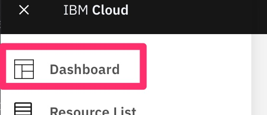
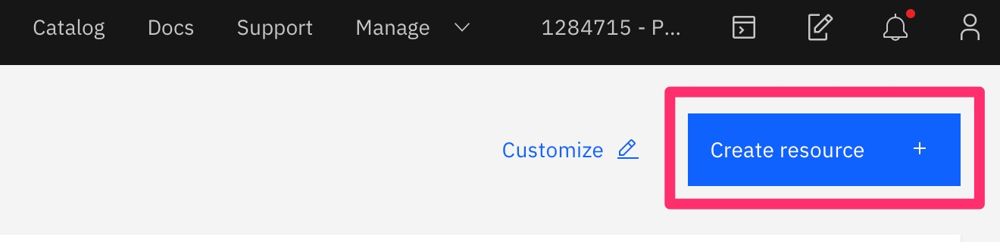
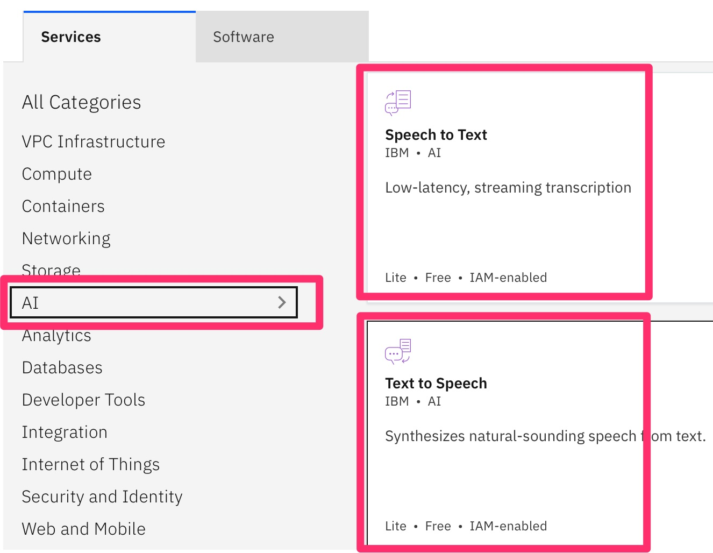
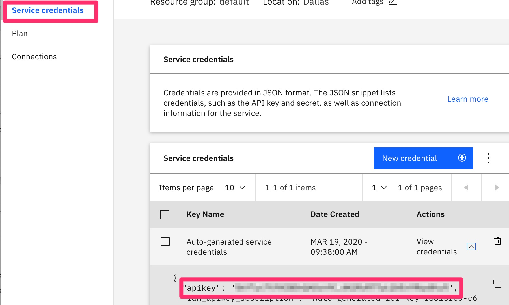

# Working with watson

To use the IBM Watson cognitive services with the Delft AI Toolkit, you need to sign up for the free service (limited amounts of usage). Once you sign up, you'll need to activate the resources you want to use.

Currently, the toolkit only supports **Watson Speech to Text** and **Text to Speech**. Other services planned for the toolkit include Assistant/chat, sentiment, and others - let us know if your application needs something else.

[BACK TO MAIN DOCUMENTATION TOC](README.md)
_______________
<!-- TOC START min:2 max:3 link:true asterisk:false update:true -->
- [How to set up your Watson Services](#how-to-set-up-your-watson-services)
  - [Get an IBM Cloud account](#get-an-ibm-cloud-account)
  - [Set up your Resources and get apiKeys](#set-up-your-resources-and-get-apikeys)
  - [Add the apikeys to the toolkit settings in Unity3D](#add-the-apikeys-to-the-toolkit-settings-in-unity3d)
<!-- TOC END -->
_______________

## How to set up your Watson Services

### Get an IBM Cloud account
Go to [IBM Cloud](http://cloud.ibm.com) and create an account 

### Set up your Resources and get apiKeys
1. Go to your Dashboard by selecting it from the dropdown menu in the upper left of your account page  
  
1. On the dashboard, click on **Create Resource** on the upper right  
  
1. On left Services panel, select AI   
  
1. In the services that are shown, scroll down and select Speech to Text  
1. On the new page, select the **Lite** pricing plan  
  
1. On the new page, select **Sercice Credentials** on the left column  
  
1. Do the same process and create a new Text to Speech resource  
  

### Add the apikeys to the toolkit settings in Unity3D
1. In the toolkit project in Unity, select Delft AI Toolkit>Show Settings in the the menu bar. If needed, click on the Inspector tab  
1. Under the Watson Services part, paste in the corresponding apikey into the Iam Key field for Text to Speech and Speech to Text  
1. While the setting are open, you can also paste in the IP address of the physical robot  

